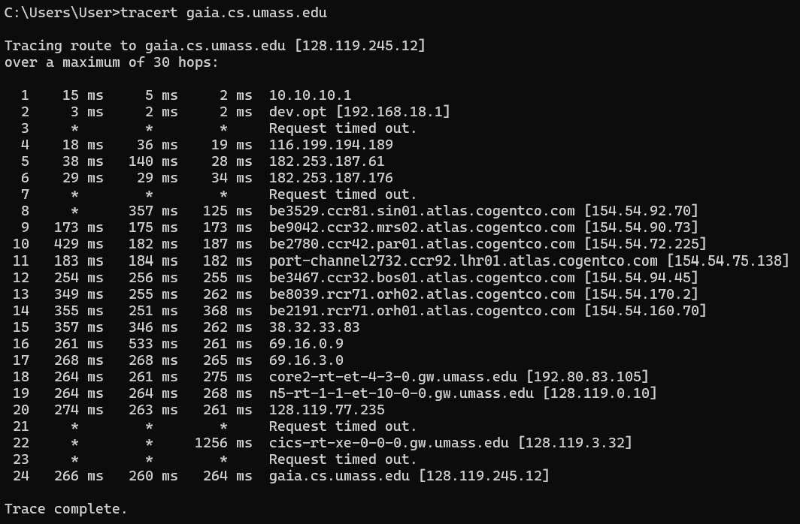
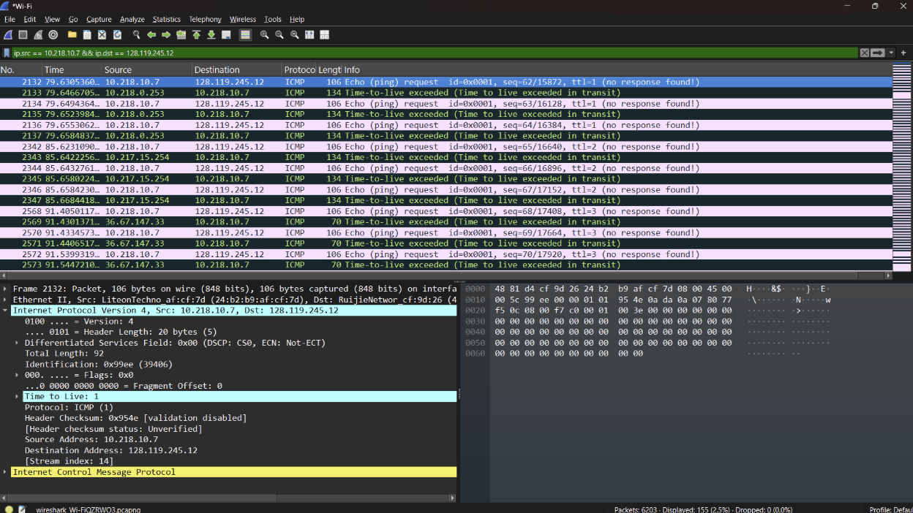
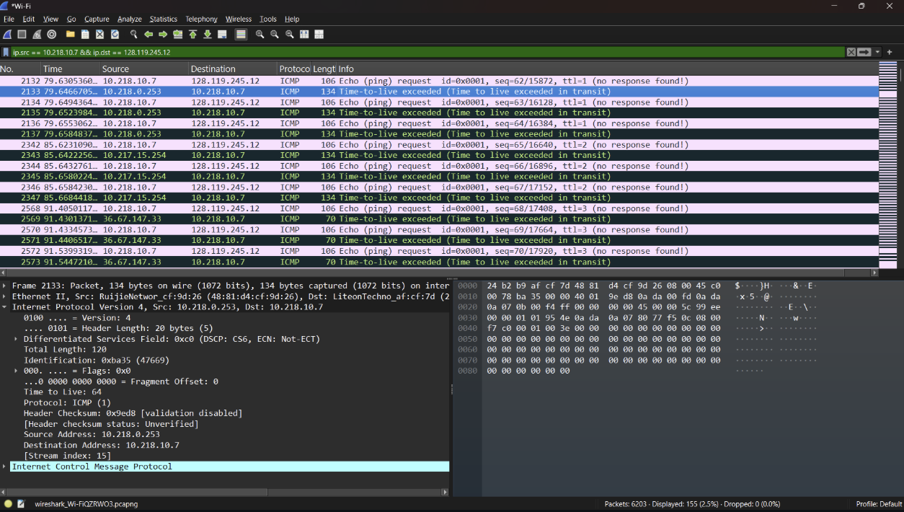
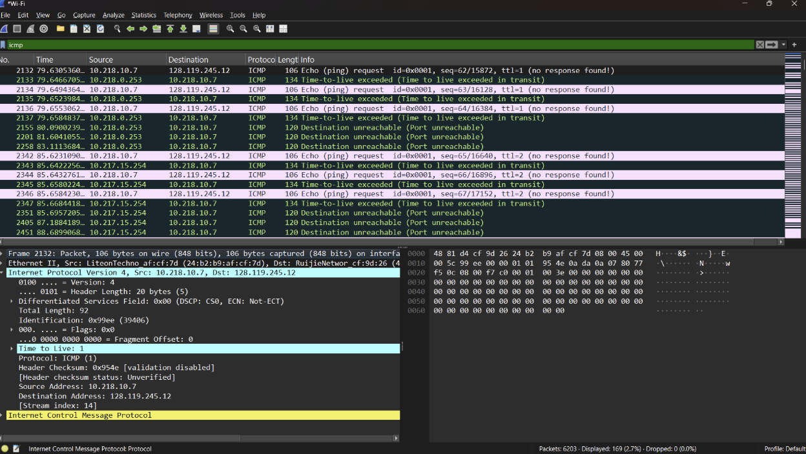
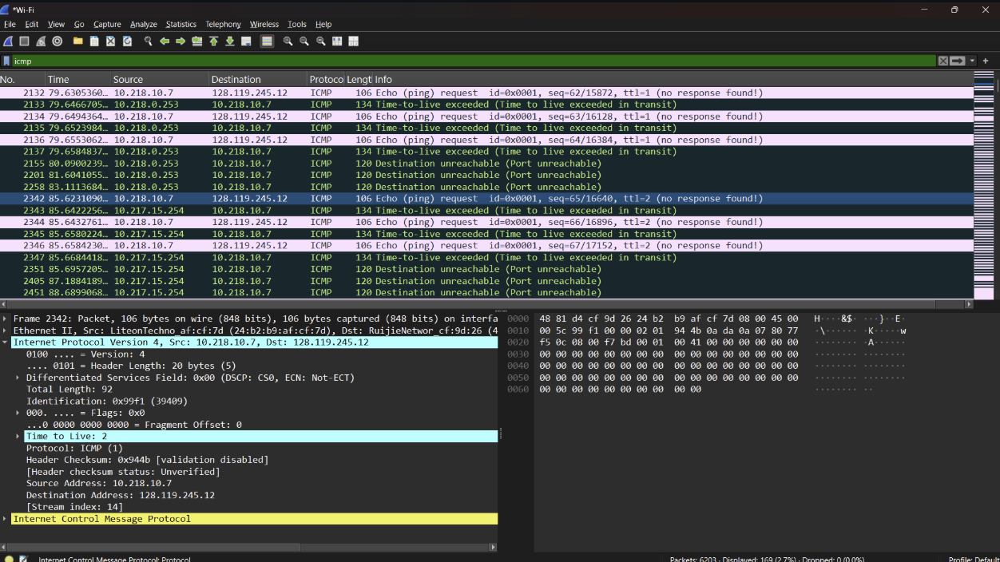
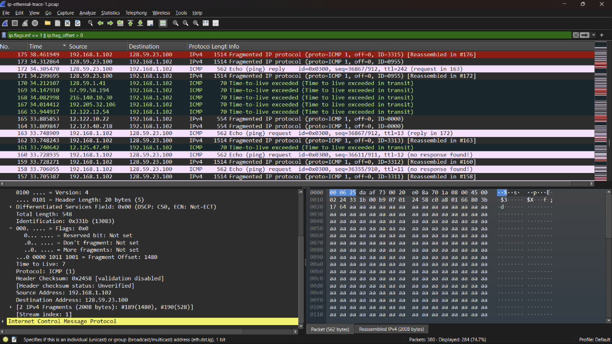
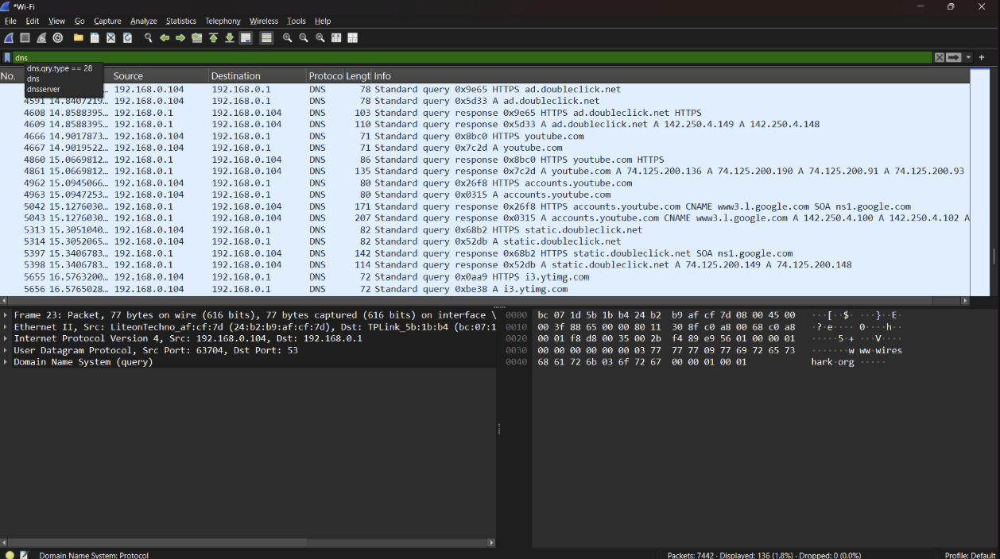

# LAPORAN PRAKTIKUM JARKOM MODUL 10

## Tujuan
Mahasiswa dapat menginvestigasi cara kerja protokol IP menggunakan Wireshark

## Menangkap paket dari eksekusi traceroute >tracert gaia.cs.umass.edu

IPv4 Dasar
TTL 1

TTL 2

Berdasarkan hasil capture Wireshark, komputer mengirim paket ICMP Echo Request ke alamat 128.119.245.12 dengan nilai TTL = 1. Router pertama pada jalur komunikasi kemudian mengurangi nilai TTL menjadi 0 dan mengembalikan pesan ICMP “Time-To-Live Exceeded”. Hal ini menandakan bahwa traceroute berhasil mendeteksi hop pertama yang dilewati paket dalam jaringan.

Fregmentasi

Berdasarkan hasil analisis, ditemukan adanya proses fragmentasi IP. Hal ini terlihat dari paket yang memiliki nilai Fragment Offset sebesar 1480, yang menunjukkan bahwa paket tersebut merupakan bagian dari datagram yang telah dipecah. Nilai More Fragments (MF) = 0 menandakan bahwa paket tersebut adalah fragmen terakhir. Fragmentasi terjadi karena ukuran datagram melebihi batas Maximum Transmission Unit (MTU), sehingga harus dibagi menjadi beberapa fragmen. Adanya beberapa paket dengan nilai Identification yang sama juga menguatkan bahwa paket-paket tersebut berasal dari datagram yang sama.

IPv6

Berdasarkan hasil analisis Wireshark, ditemukan paket DNS yang mengandung permintaan tipe A (IPv4), seperti pada domain youtube.com dan doubleclick.net. Namun, tidak ditemukan permintaan DNS bertipe AAAA (IPv6). Hal ini menunjukkan bahwa selama proses capture, sistem hanya melakukan resolusi alamat IPv4 tanpa melakukan pencarian alamat IPv6. Kondisi tersebut kemungkinan dipengaruhi oleh konfigurasi jaringan atau DNS server yang lebih memprioritaskan penggunaan IPv4.
