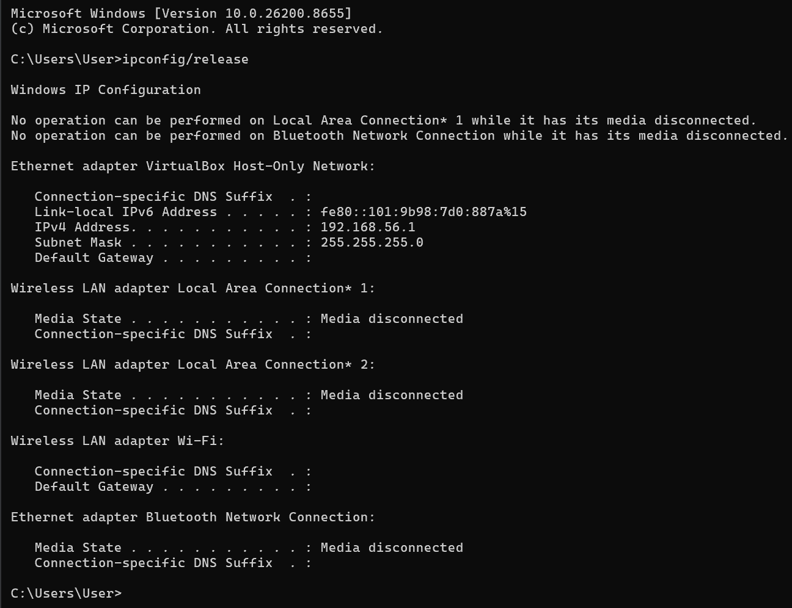
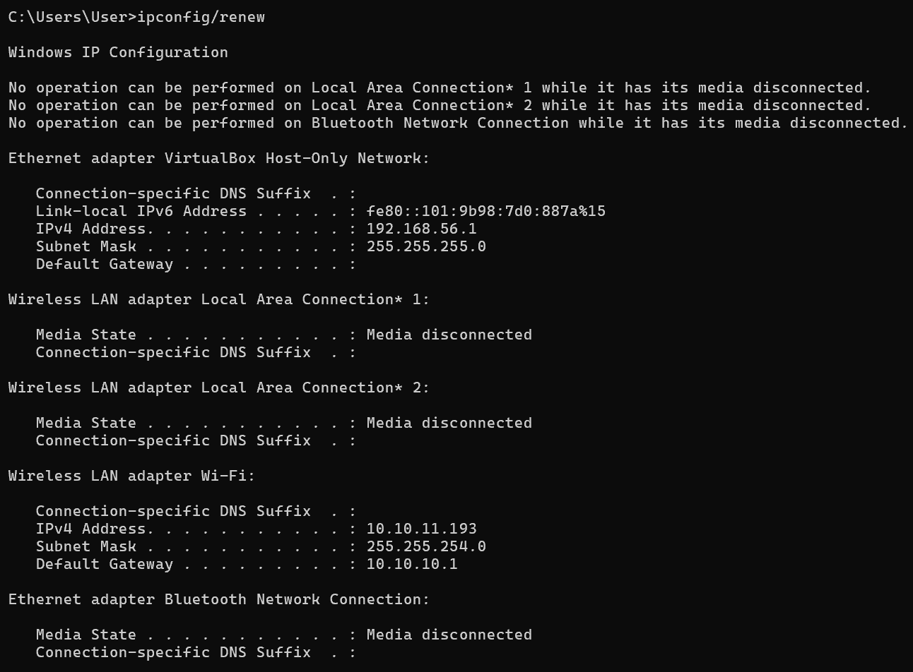
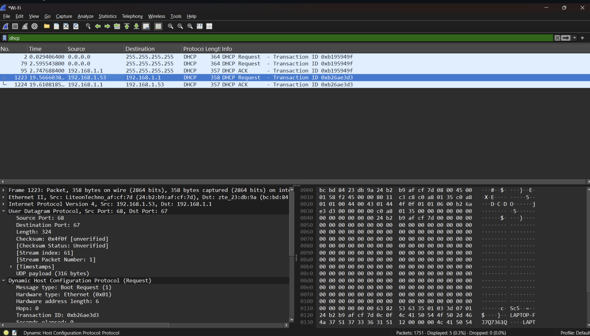
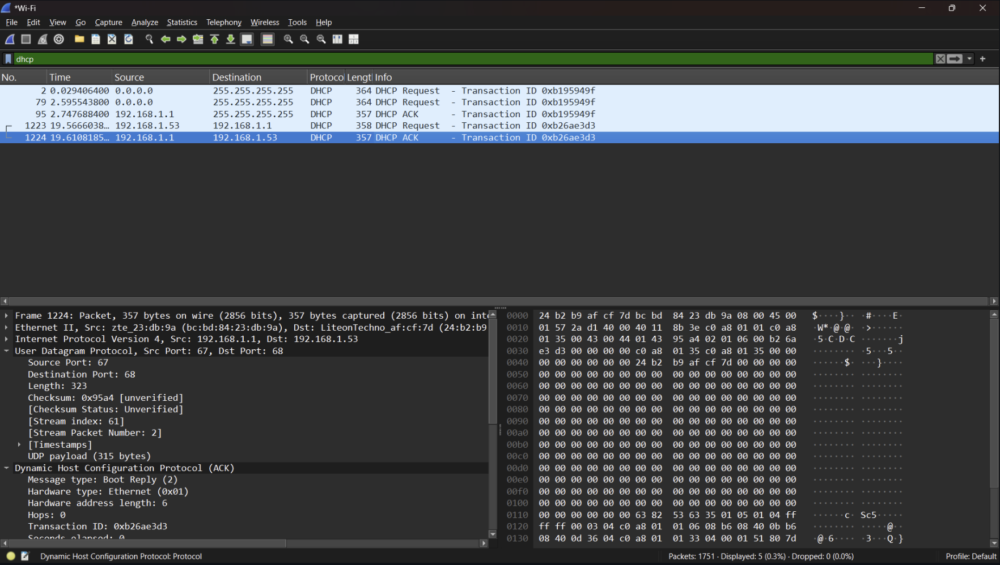

# LAPORAN PRAKTIKUM JARKOM MODUL 11 DHCP

## Tujuan
Mahasiswa dapat mengamati dan memahami cara kerja protokol DHCP menggunakan Wireshark.

## Langkah-Langkah
1. IPCONFIG/RELEASE

2. IPCONFIG/RENEW

3. DHCP REQUEST

4. DHCP ACK
Pada percobaan DHCP di Windows, hanya paket DHCP Request dan DHCP ACK yang berhasil ditangkap. Kondisi ini disebabkan oleh adanya lease IP yang masih tersimpan pada sistem, sehingga klien melakukan proses pembaruan (renewal) alamat IP tanpa menjalankan seluruh tahapan DHCP dari awal.
