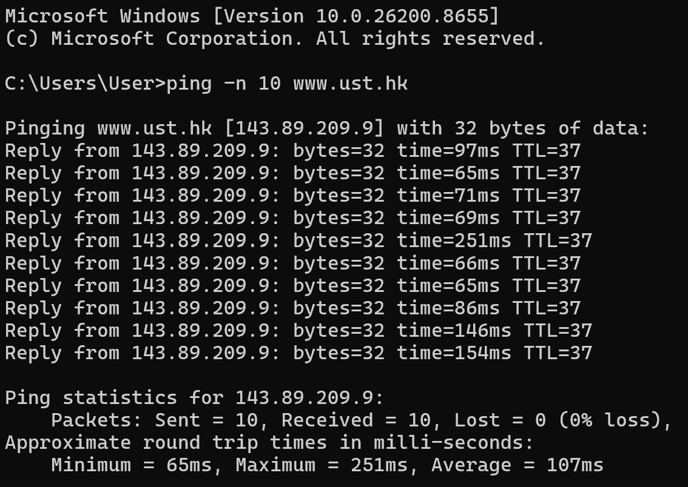
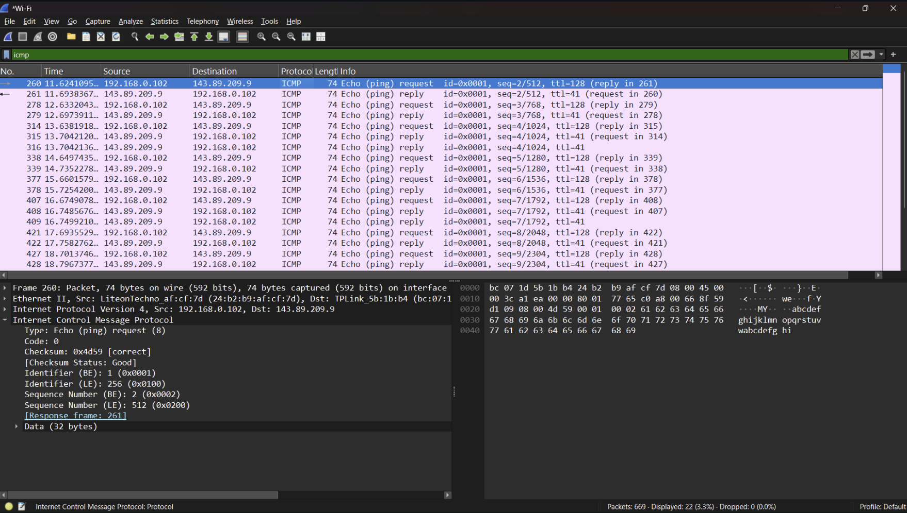
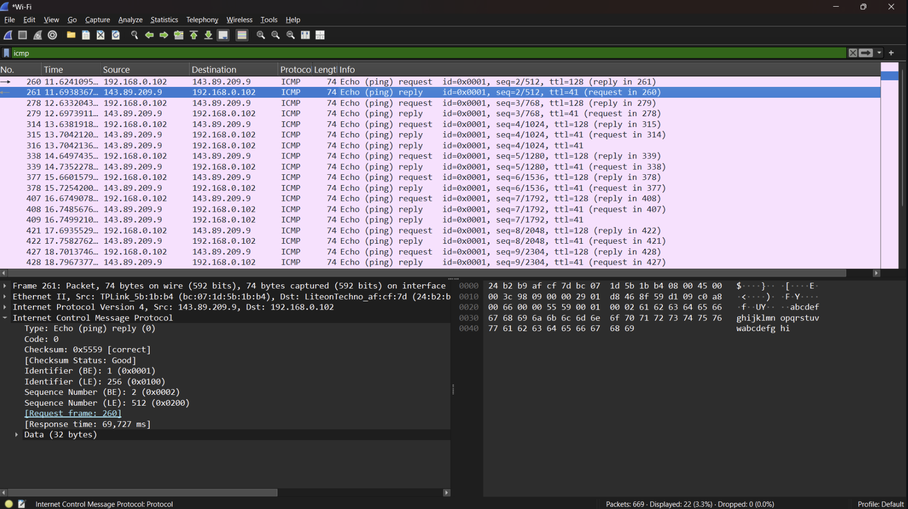
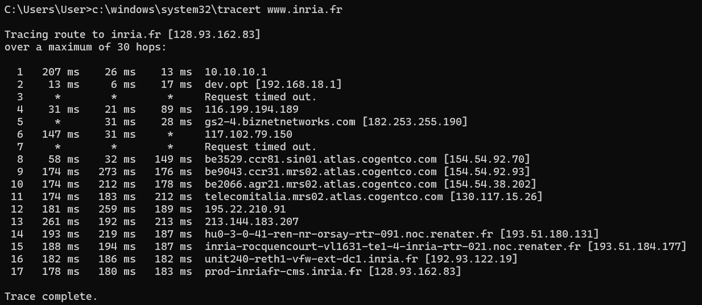
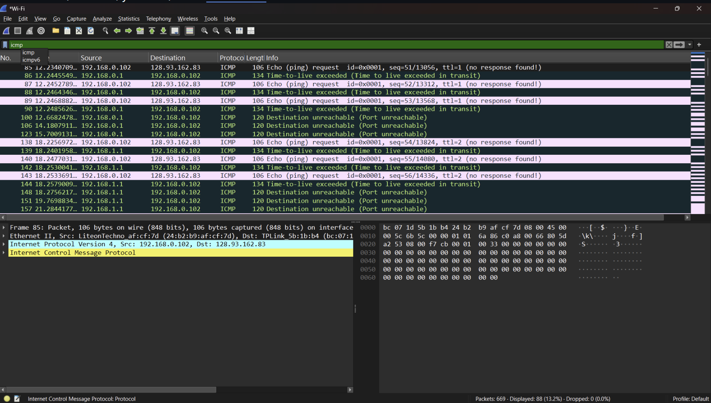
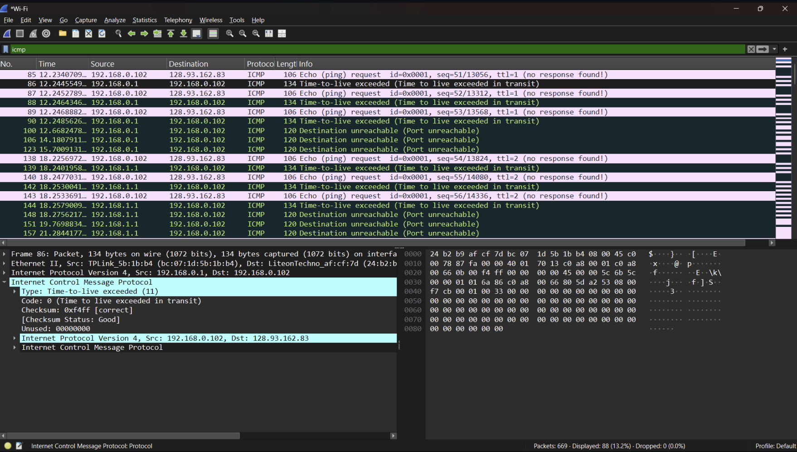

# LAPORAN PRAKTIKUM JARKOM MODUL 12

## Tujuan
Mahasiswa dapat menginvestigasi cara kerja protokol ICM menggunakan Wireshark

# ICMP dan PING
## Langkah-langkah
1. ping -n 10 www.ust.hk

2. ICMP ( Echo Ping Request )

3. ICMP ( Echo Ping Reply )

# ICMP dan Traceroute
## Langkah-langkah
1. c:\windows\system32\tracert www.inria.fr

2. ICMP after c:\windows\system32\tracert www.inria.fr in CMD

3. Detail Time-To-Live Exceeded

