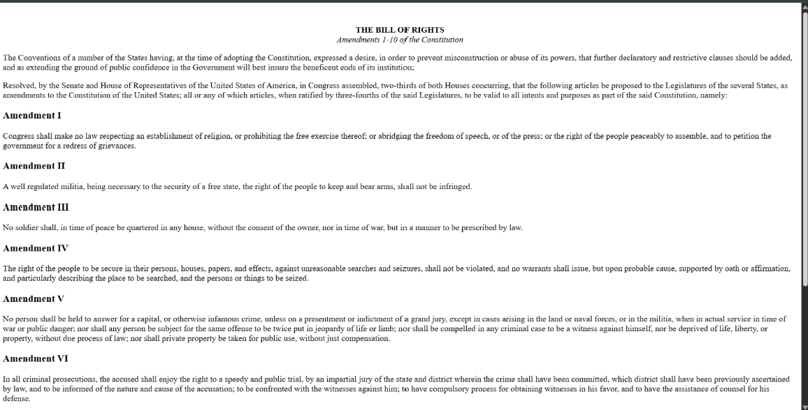
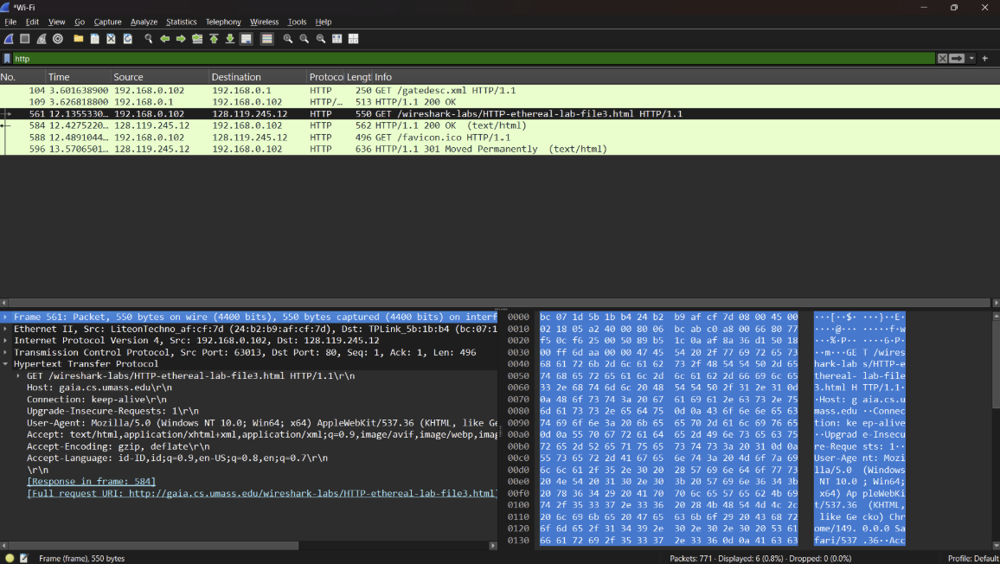
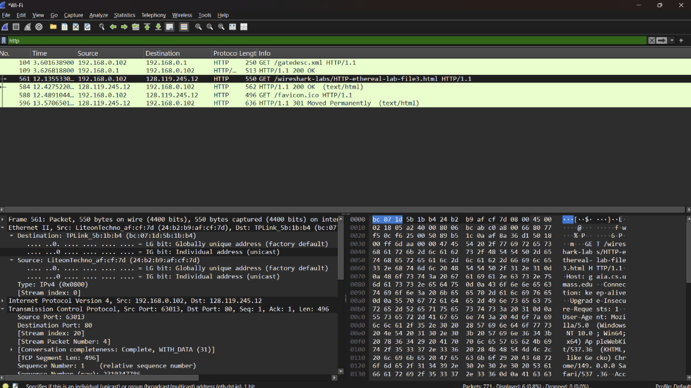
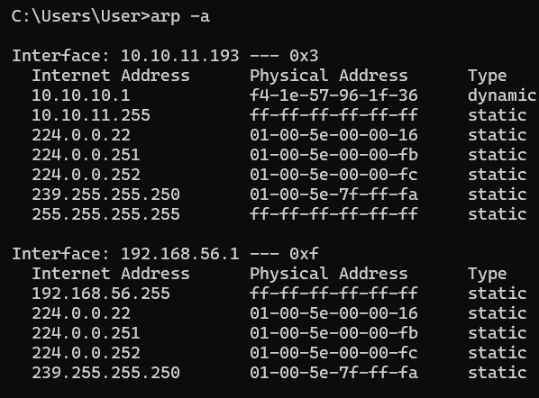
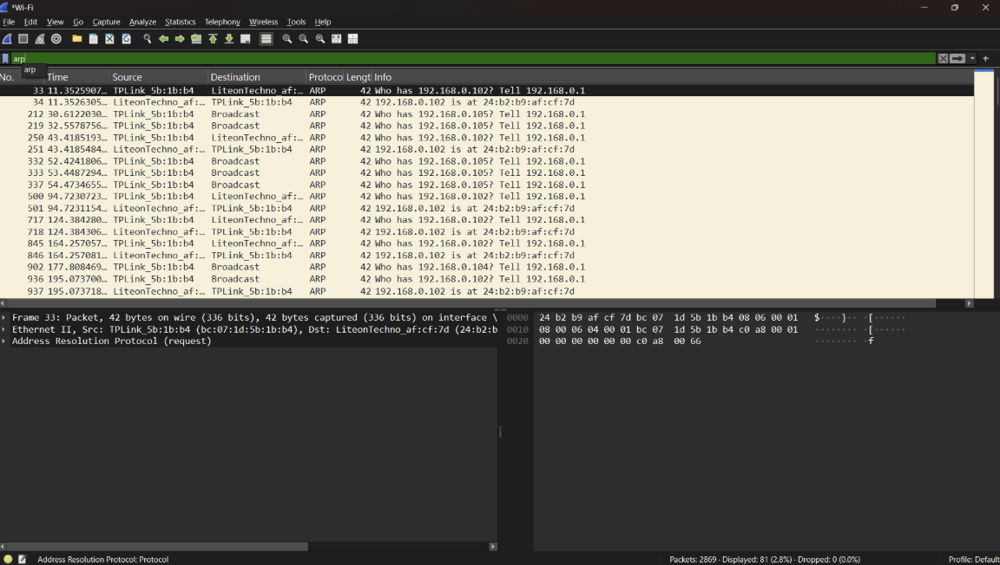

# LAPORAN PRAKTIKUM JARKOM MODUL 13

## Tujuan 
Mahasiswa dapat menginvestigasi cara kerja Ethernet dan ARP menggunakan Wireshark

## Menangkap dan menganalisis frame Ethernet
Langkah-langkah
1. (http://gaia.cs.umass.edu/wireshark-labs/HTTP-ethereal-lab-file3.html)

2. HTTP after open gaia.cs.umass.edu/wireshark-labs/HTTP-ethereal-lab-file3.html

## Caching ARP
Langkah-langkah
1. Buka CMD lalu ketik arp -a

2. Paket ARP

