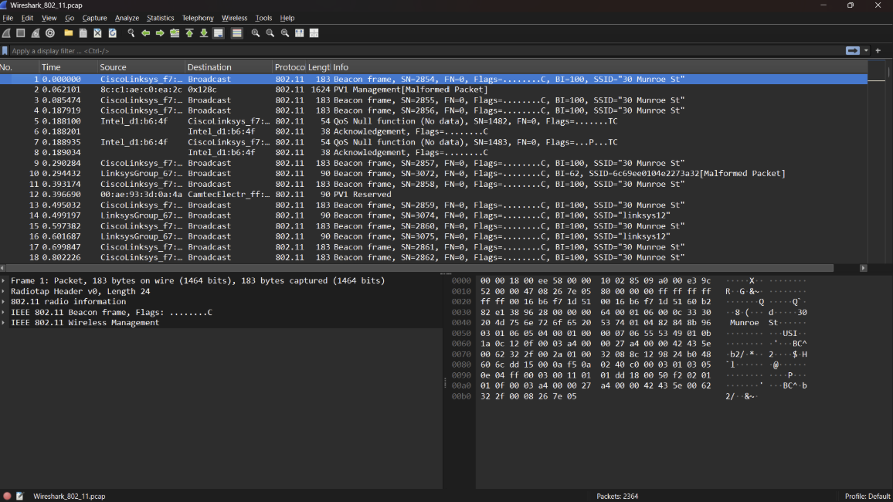
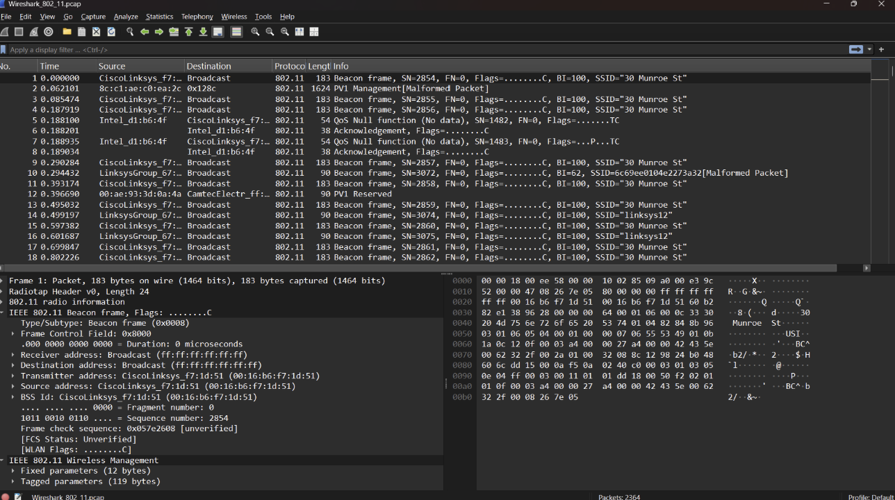
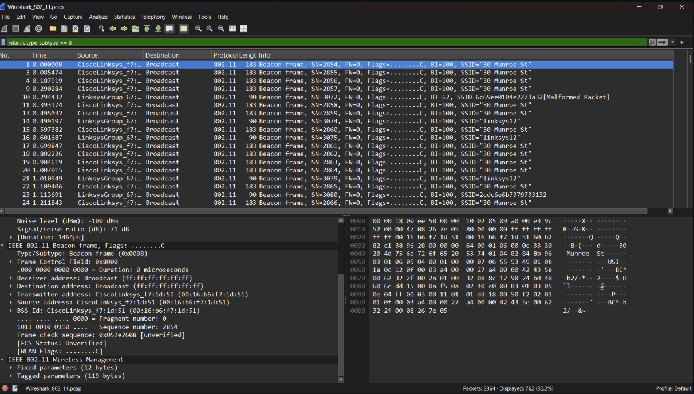
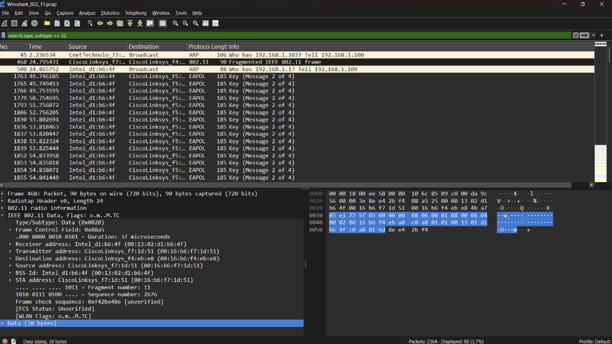
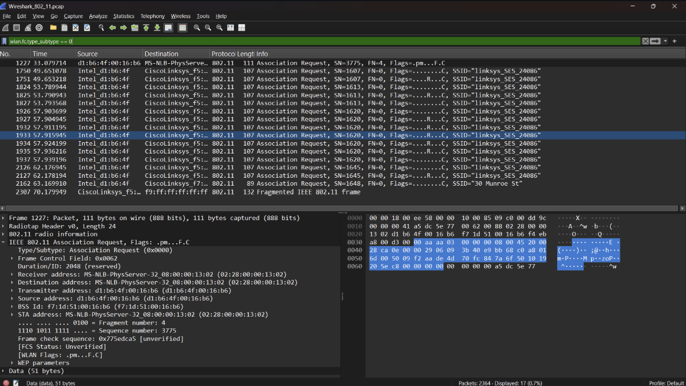
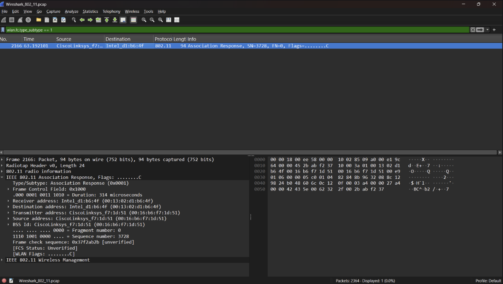

# LAPORAN PRAKTIKUM JARKOM MODUL 14

## WireShark_802_11.pcap
1. Saat proses pelacakan dimulai, host sudah terhubung dengan access point (AP) 30 Munroe St. Pada t = 24,82 detik, host mengirim permintaan HTTP ke http://gaia.cs.umass.edu/wiresharklabs/alice.txt dengan alamat IP tujuan 128.119.245.12.
2. Pada t = 32,82 detik, host mengakses situs http://www.cs.umass.edu yang memiliki alamat IP 128.119.240.19.
3. Pada t = 49,58 detik, host memutus koneksi dari AP 30 Munroe St dan mencoba terhubung ke AP linksys_ses_24086, tetapi koneksi gagal karena AP tersebut tidak dapat diakses. Kemudian, pada t = 63,0 detik, host menghentikan upaya tersebut dan kembali terhubung ke AP 30 Munroe St.

## Beacon Frames
Mengumumkan keberadaan jaringan WiFi (SSID) dan memberikan informasi konfigurasi jaringan kepada perangkat di sekitar.

Analisis :
SSID = 30 Munroe St
BSSID = 00:16:b6:f7:1d:51
SOURCEADDRESS = 00:16:b6:f7:1d:51
DESTINATIONADDRESS = ff:ff:ff:ff:ff:ff
Beacon Interval = BI = 100 Beacon Interval = 100 TU (Time Unit)

## Data Transfer
 Mengirimkan data pengguna seperti HTTP, TCP, DNS, dan aplikasi lainnya melalui jaringan WiFi.
 

 ## Association/Disassociation
 Association Request adalah frame yang dikirim oleh client (station) kepada Access Point untuk meminta izin bergabung ke jaringan WiFi.

 Fungsi Assocation Response : B alasan dari Access Point terhadap permintaan Association Request dari client.

Fungsi Disassociation: Disassociation berfungsi untuk mengakhiri koneksi antara client (station) dan Access Point (AP) pada jaringan WiFi. Pada file Wireshark_802_11.pcap yang digunakan dalam praktikum, tidak ditemukan frame Disassociation. Hal ini menunjukkan bahwa selama proses perekaman tidak terjadi pemutusan koneksi antara client dan AP, atau proses tersebut tidak terekam dalam hasil capture.
