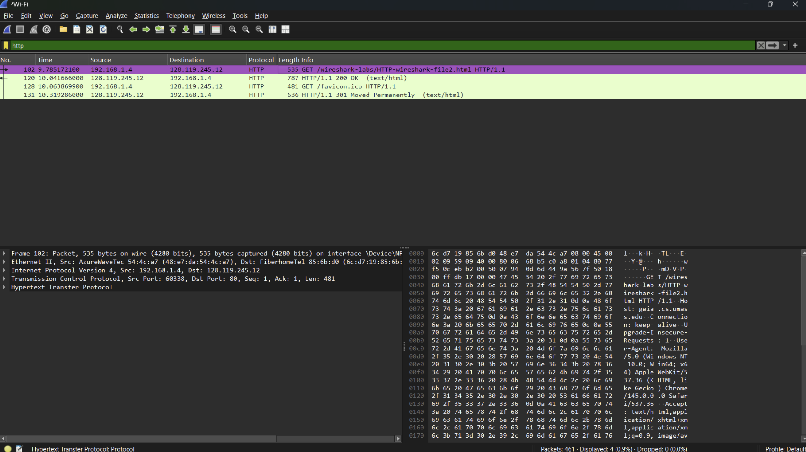

# Laporan Praktikum Jarkom 3_2 HTTP CONDITIONAL GET/response interaction

## Tujuan Praktikum
Memahami cara kerja protokol HTTP menggunakan Wireshark.

## Langkah percobaan
1. Buka aplikasi Wireshark.
2. Lalu ilih jaringan WiFi.
3. Buka browser, lalu hapus cache dan history dulu kalau belum.
4. Setelah itu, klik Start Capturing di Wireshark.
5. Saat Wireshark berjalan, buka link ini di browser: http://gaia.cs.umass.edu/wireshark-labs/HTTP-wireshark-file2.html
6. Setelah halaman terbuka, buka lagi link yang sama dengan cepat (atau tekan refresh).
7. Kembali ke Wireshark, lalu klik Stop (ikon merah).
8. Terakhir, ketik http di kolom filter atas supaya yang terlihat hanya paket HTTP.

## Lampiran
Hasil Percobaan:
