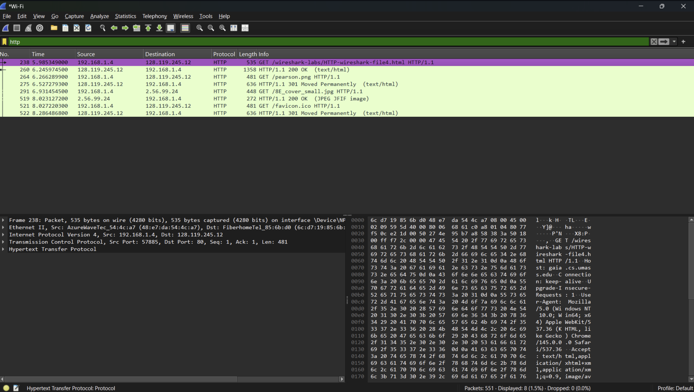

# Laporan Praktikum Jarkom 3_4 HTTP CONDITIONAL GET/response interaction

## Tujuan Praktikum
Memahami cara kerja protokol HTTP menggunakan Wireshark.

## Langkah percobaan
1. Buka aplikasi Wireshark.
2. Pilih jaringan WiFi.
3. Lalu buka browser, lalu hapus cache dan history dulu kalau belum.
4. Kemudian klik Start Capturing di Wireshark untuk mulai merekam.
5. Saat Wireshark berjalan, buka link ini di browser: http://gaia.cs.umass.edu/wireshark-labs/HTTP-wireshark-file4.html
6. Setelah halaman terbuka, kembali ke Wireshark.
7. Lalu klik Stop (ikon merah) untuk menghentikan.
8. Terakhir, ketik http di kolom filter atas supaya hanya paket HTTP yang terlihat.

## Lampiran
Hasil Percobaan:
