# Laporan Praktikum Jarkom

## Tujuan Praktikum
Dapat mengetahui cara kerja DNS menggunakan Wireshark

## 4.2 NSlookup
1. Dari pengujian menggunakan perintah nslookup www.youtube.com, didapatkan bahwa domain tersebut diterjemahkan menjadi beberapa alamat IP (IPv4 dan IPv6). Hal ini menunjukkan bahwa satu domain bisa memiliki banyak IP untuk mendukung performa dan distribusi server. Untuk permintaan DNS diproses melalui resolver lokal dengan alamat 192.168.18.1.
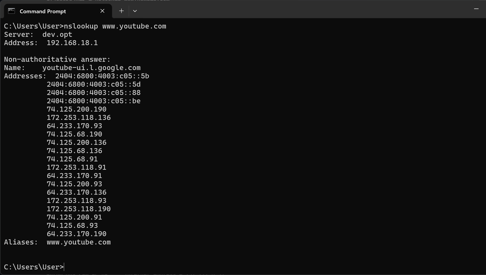

2. Berdasarkan perintah nslookup -type=NS cam.ac.uk, diketahui bahwa domain tersebut memiliki beberapa name server, seperti ns2.ic.ac.uk, ns3.mythic-beasts.com, auth0.dns.cam.ac.uk, auth1.dns.cam.ac.uk, dan lainnya. Beberapa server memiliki alamat IPv4 seperti 131.111.8.37, 131.111.12.37, 128.232.0.19, dan juga mendukung IPv6. Permintaan ini juga diproses melalui DNS resolver lokal 192.168.18.1.
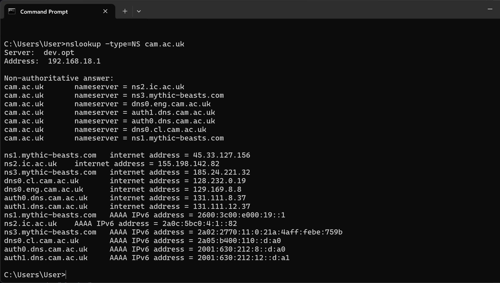

3. Dari perintah nslookup -type=MX yahoo.com ns2.ic.ac.uk, terlihat bahwa server ns2.ic.ac.uk (155.198.142.82) berhasil memberikan informasi mail server Yahoo. Hasilnya menunjukkan beberapa MX record seperti mta6.am0.yahoodns.net, mta7.am0.yahoodns.net, dan mta5.am0.yahoodns.net dengan prioritas yang sama. Ini menandakan bahwa server DNS tersebut tetap bisa merespon query meskipun domain yang diminta bukan miliknya.
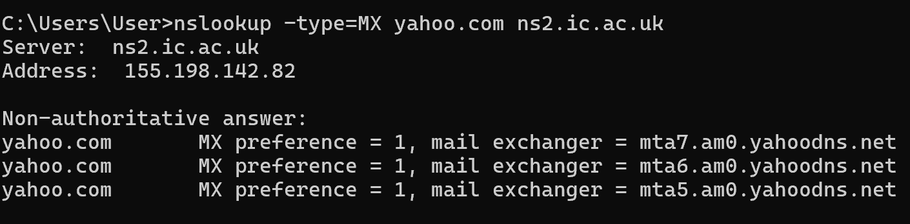

## 4.3 Ipconfig
1. Perintah ipconfig digunakan untuk melihat konfigurasi jaringan pada komputer. Dari hasilnya, kita bisa melihat IPv4 Address, Subnet Mask, dan Default Gateway yang dipakai untuk terhubung ke jaringan lain.
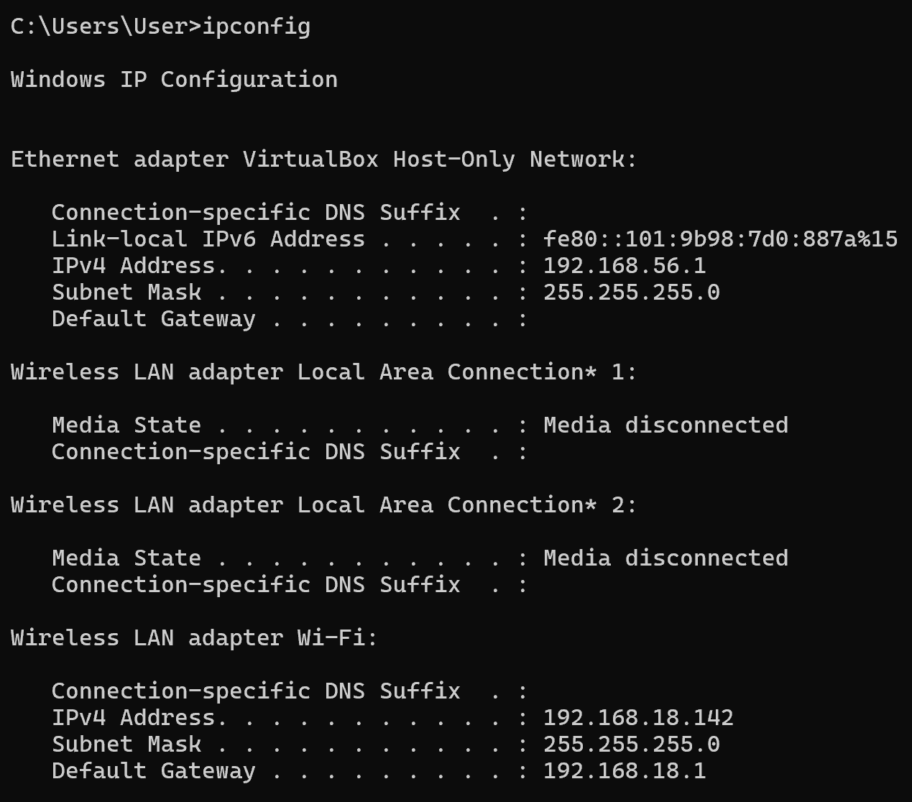

2. Perintah ipconfig /all menampilkan informasi jaringan yang lebih lengkap. Di sini bisa dilihat IPv4 Address, MAC Address (Physical Address), DNS Server, DHCP Server, dan detail konfigurasi lainnya.
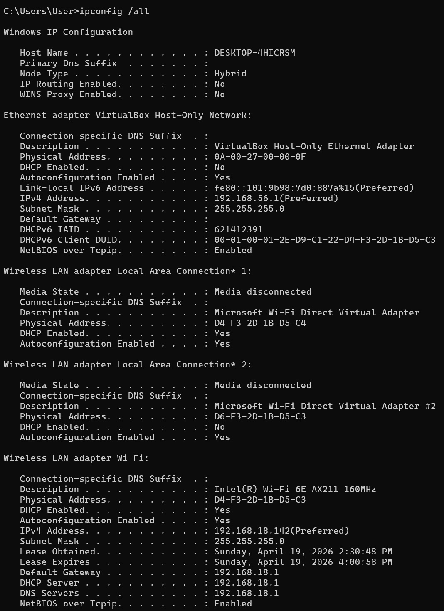

3. Perintah ipconfig /displaydns digunakan untuk melihat daftar DNS cache yang tersimpan di komputer. Isinya adalah domain yang pernah diakses beserta alamat IP-nya sehingga akses berikutnya bisa lebih cepat tanpa query ulang.
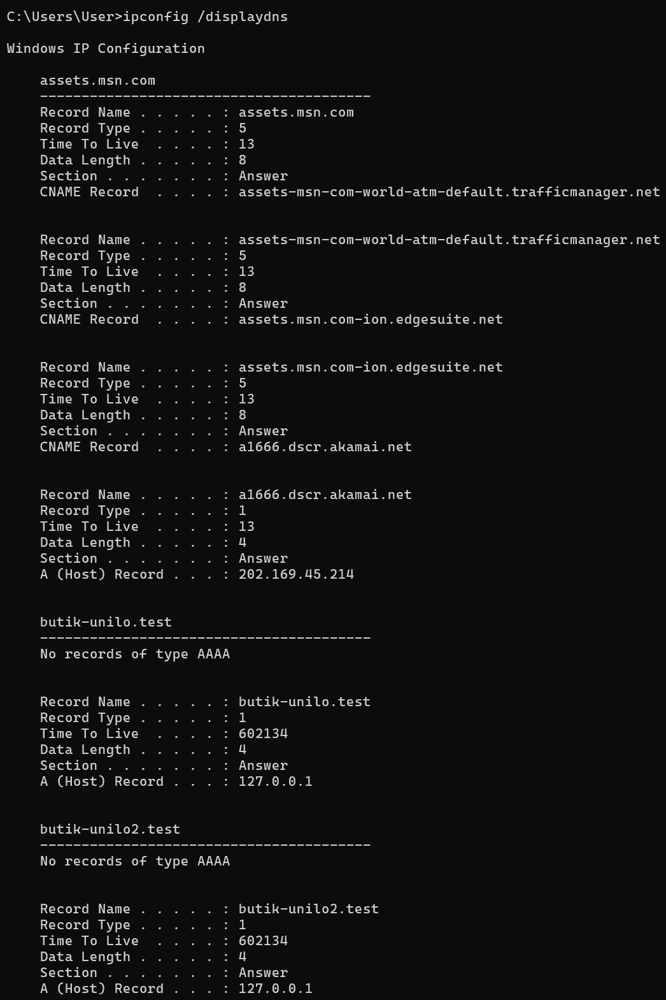

4. Perintah ipconfig /flushdns berfungsi untuk menghapus semua DNS cache di komputer. Setelah itu, sistem akan mengambil ulang data terbaru dari server DNS saat mengakses domain.
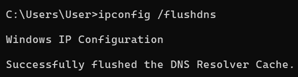

## 4.4 Tracing DNS dengan Wireshark
Langkah 1:
1. Jalankan perintah ipconfig /flushdns untuk menghapus cache DNS pada komputer.
2. Buka browser, lalu bersihkan cache agar tidak menggunakan data lama.
3. Buka Wireshark, kemudian masukkan filter: ip.addr == 192.168.18.142
4. Mulai proses capture (pengambilan paket) di Wireshark. Setelah itu, buka halaman web:http://www.ietf.org
5. Kemudian hentikan proses capture di Wireshark.

Jawab:
1. Berdasarkan hasil tangkapan Wireshark, pesan permintaan DNS (DNS query) dan pesan balasannya (DNS response) dikirim menggunakan protokol UDP (User Datagram Protocol). Hal ini terlihat pada detail paket yang menunjukkan penggunaan UDP dengan port 53 sebagai port standar DNS. Dengan demikian, dapat disimpulkan bahwa komunikasi DNS pada percobaan ini menggunakan UDP, bukan TCP.
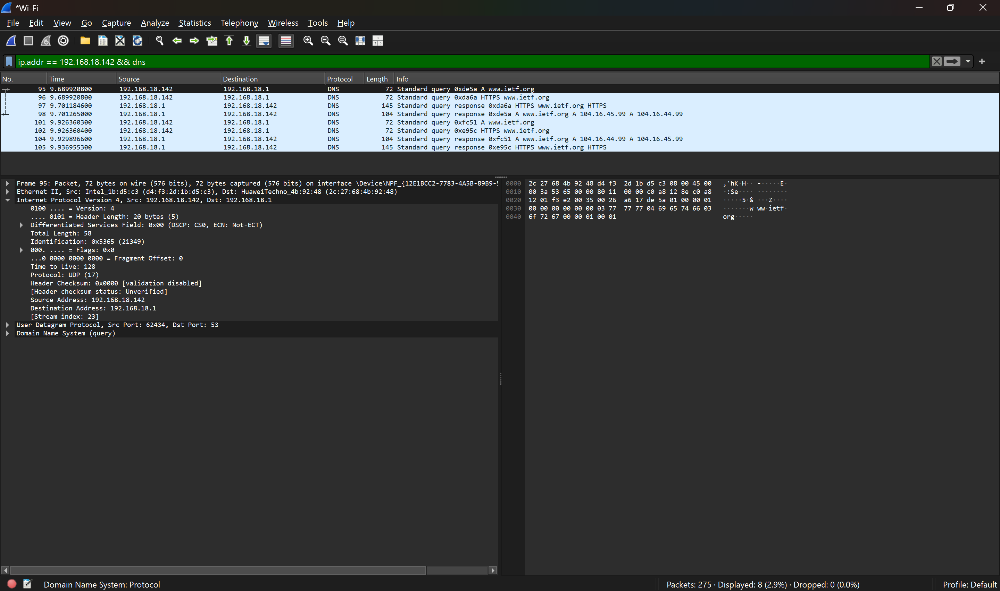

2. Berdasarkan hasil analisis pada Wireshark, port tujuan pada pesan DNS query adalah 53, yang merupakan port standar untuk server DNS. Sedangkan pada DNS response, port sumbernya juga 53 karena balasan dikirim oleh server DNS. Dengan demikian, komunikasi DNS menggunakan port 53 sebagai port utama di sisi server.
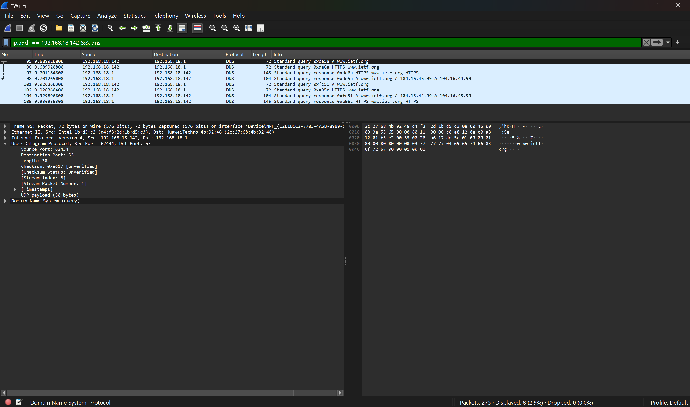

3. Berdasarkan hasil tangkapan Wireshark, alamat IP tujuan pada DNS query adalah 192.168.18.1, yang merupakan alamat IP dari DNS server lokal. Sementara itu, berdasarkan hasil ipconfig, alamat IP komputer (host) adalah 192.168.18.142. Dengan demikian, kedua alamat IP tersebut berbeda, karena satu merupakan IP client dan satu lagi merupakan IP DNS server.

4. Berdasarkan hasil analisis pada DNS query, tipe (type) yang digunakan adalah type A, yaitu untuk meminta alamat IP (IPv4) dari domain www.ietf.org. Selain itu, pada bagian ini tidak terdapat jawaban (answers = 0), karena paket tersebut merupakan permintaan dari client ke server DNS.
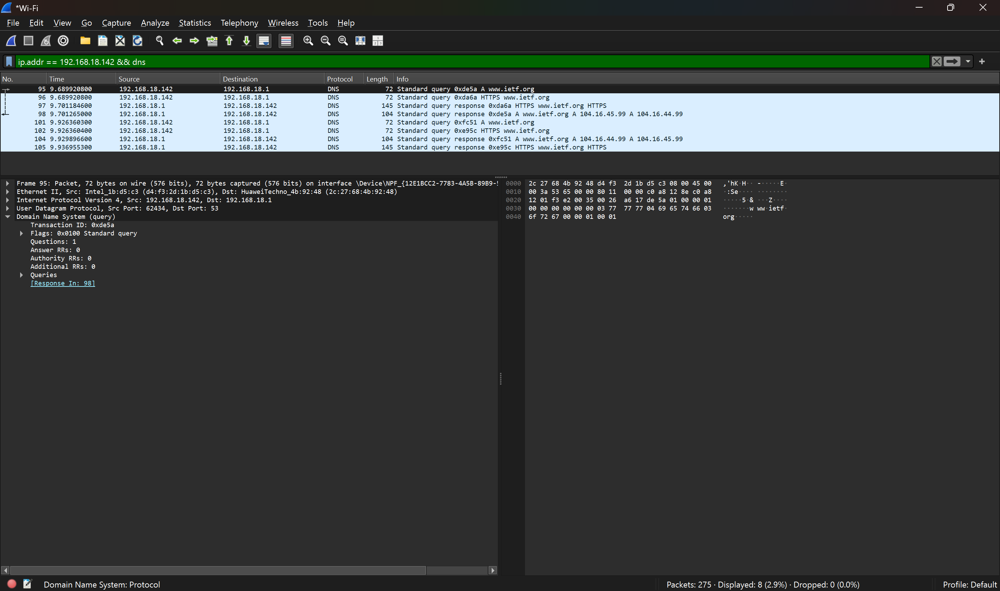

5. Berdasarkan hasil analisis pada DNS response, terdapat 2 jawaban (Answers = 2) yang diberikan oleh server DNS. Kedua jawaban tersebut berisi alamat IP untuk domain www.ietf.org, yaitu 104.16.45.99 dan 104.16.44.99. Hal ini menunjukkan bahwa satu domain dapat memiliki lebih dari satu alamat IP.
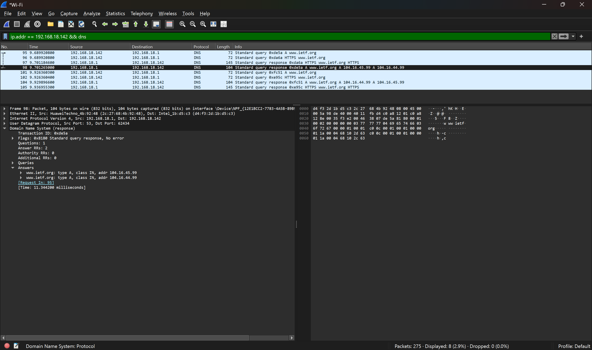

6. Berdasarkan hasil analisis pada Wireshark, paket TCP SYN yang dikirim oleh host memiliki alamat IP tujuan 104.16.44.99. Alamat ini sesuai dengan salah satu alamat IP yang diperoleh dari DNS response sebelumnya. Dengan demikian, host menggunakan hasil DNS untuk melakukan koneksi ke server tujuan.
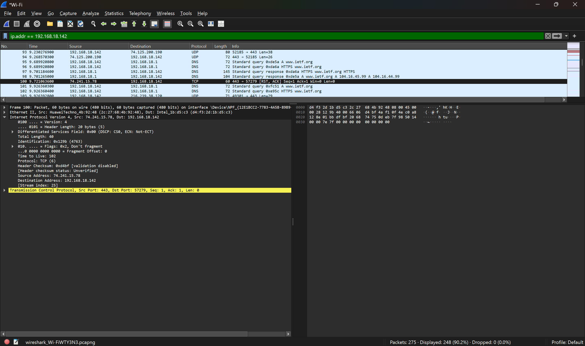

7. Berdasarkan hasil tangkapan Wireshark, tidak semua akses ke halaman web memerlukan DNS query baru. Jika domain yang diakses sama, maka hasil DNS dapat disimpan dalam cache. Namun, jika halaman memuat konten dari domain yang berbeda, maka akan dilakukan DNS query baru untuk domain tersebut.
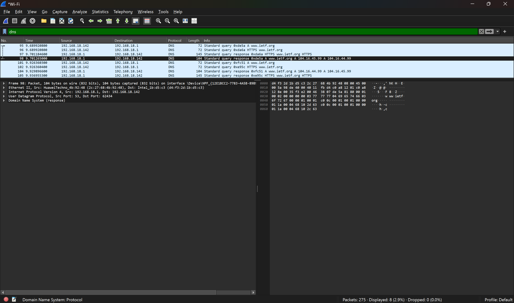

Langkah 2:
1. Mulai proses capture paket di Wireshark
2. Ketik perintah nslookup www.mit.edu di cmd/powershell
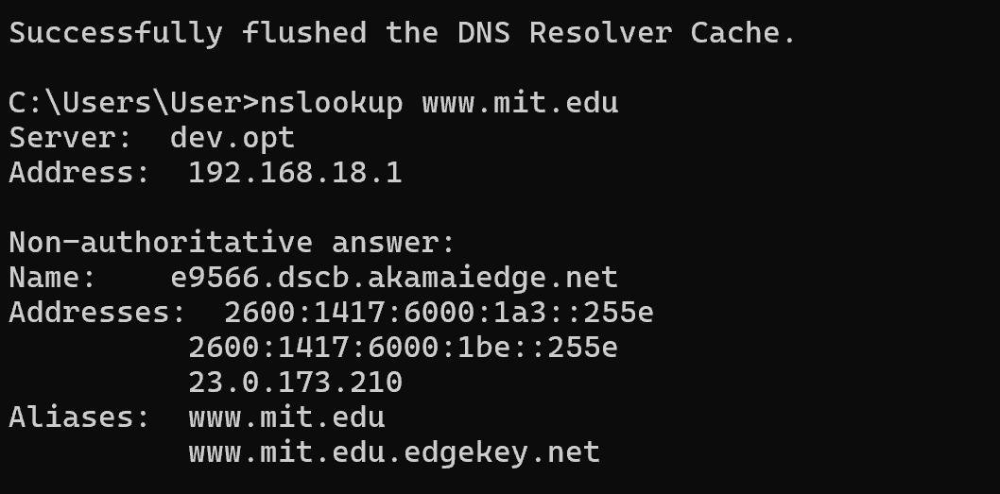
3. Setelah itu, hentikan proses capture paket di Wireshark.

Jawab:
1. Berdasarkan hasil Wireshark, port tujuan pada pesan DNS query adalah 53. Sedangkan pada DNS response, port sumbernya juga 53 karena balasan dikirim oleh server DNS. Terlihat juga bahwa klien menggunakan port 52728 untuk mengirim permintaan ke server melalui port 53.
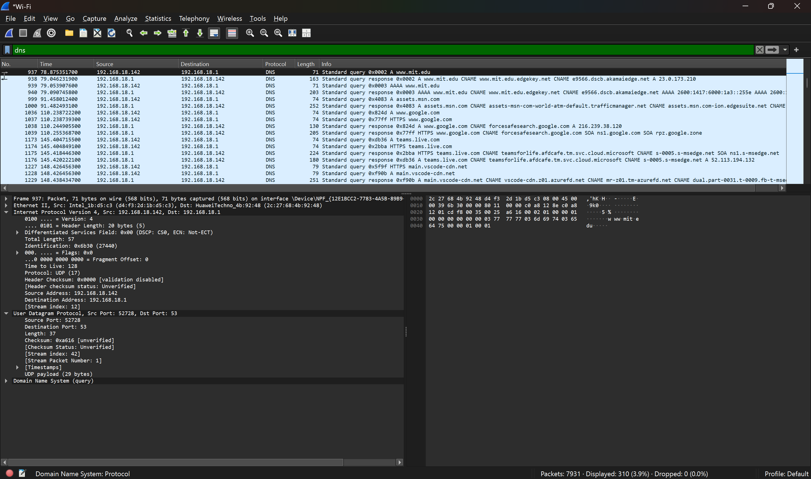

2. Pesan permintaan DNS dikirim ke alamat IP 192.168.18.1. Alamat ini merupakan DNS server lokal (default gateway) yang digunakan oleh komputer. Jadi, alamat tersebut memang sesuai sebagai server DNS pada jaringan.
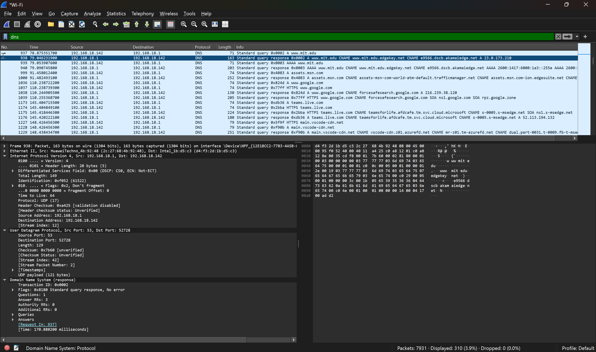

3. Pada DNS query, jenis (type) pesan yang digunakan adalah type A (Address). Pesan ini tidak mengandung jawaban (answers = 0) karena hanya berupa permintaan dari klien untuk mencari alamat IP.
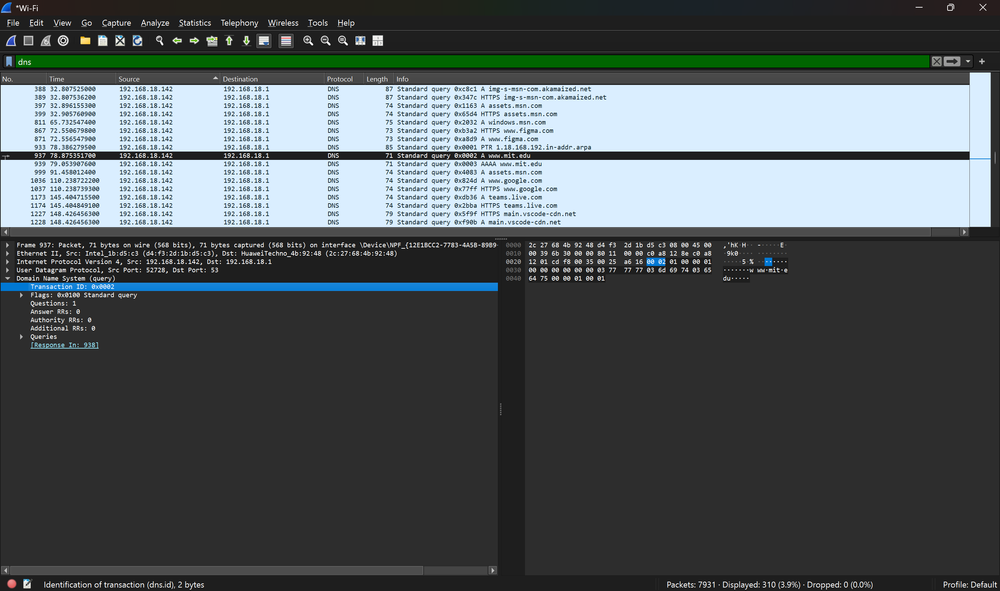

4. Pada DNS response terdapat 3 jawaban (answers). Isi dari jawaban tersebut adalah hasil resolusi domain www.mit.edu, berupa CNAME (alias) dan juga alamat IP (A record) dari server tujuan.
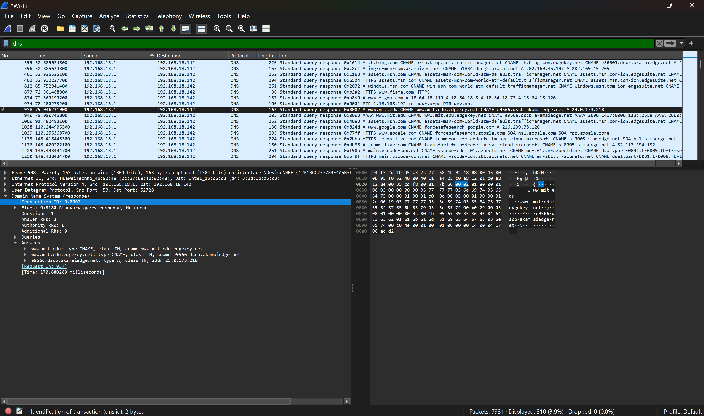

Langkah 3:
1. Mulai proses capture paket di Wireshark.
2. Buka Command Prompt (cmd), lalu jalankan perintah: nslookup -type=NS mit.edu
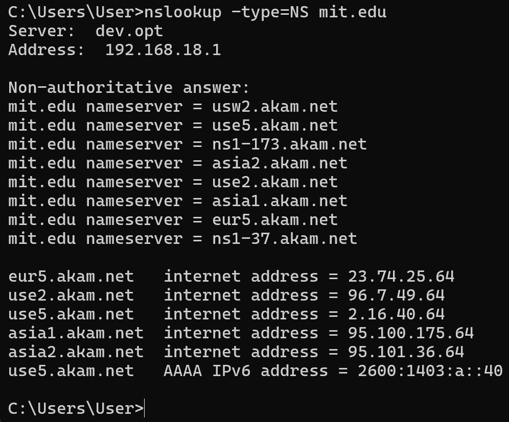
3. Setelah itu, hentikan proses capture paket di Wireshark.

Jawab:
1. Berdasarkan hasil Wireshark, pesan permintaan DNS dikirim ke alamat IP 192.168.18.1. Alamat ini merupakan DNS server lokal (default gateway) yang digunakan oleh komputer. Jadi, alamat tersebut memang sesuai sebagai server DNS pada jaringan.
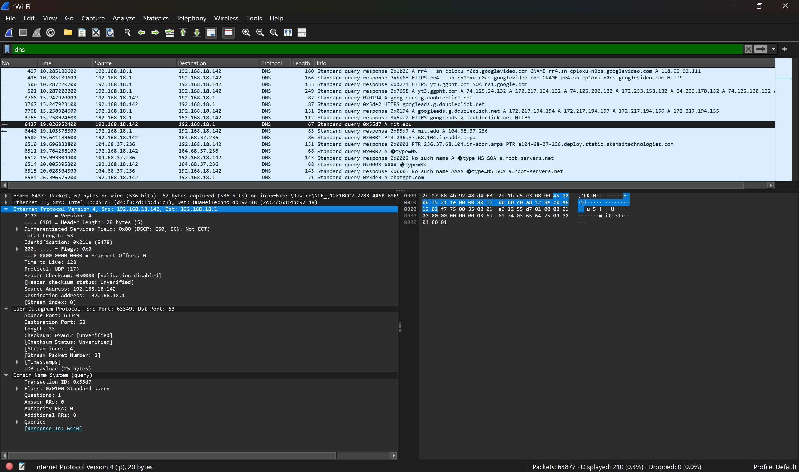

2. Pada DNS query, jenis (type) pesan yang digunakan adalah NS (Name Server). Pesan ini tidak mengandung jawaban (answers = 0), karena hanya berupa permintaan dari klien untuk mengetahui server DNS dari domain mit.edu.

3. Berdasarkan DNS response, server memberikan hasil berupa alamat IP 104.68.37.236 untuk domain mit.edu. Jadi, pada hasil ini tidak ditampilkan daftar nama server (NS), melainkan langsung memberikan alamat IP dari domain tersebut. Dengan demikian, balasan DNS pada percobaan ini berisi IP address, bukan daftar name server lengkap.
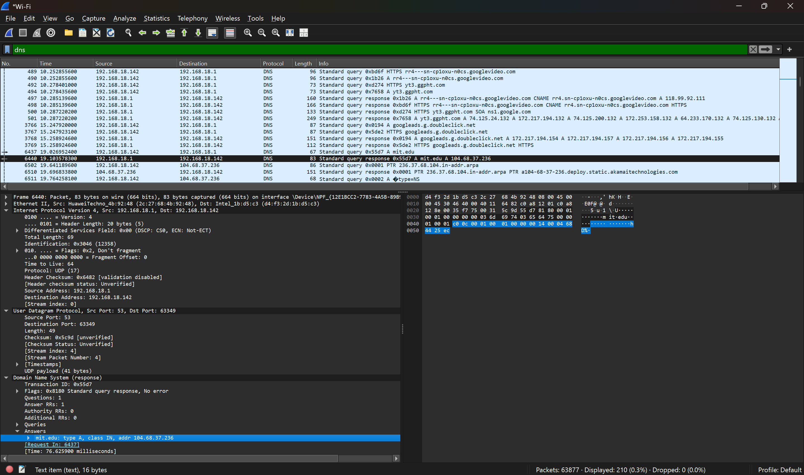

Langkah 4:
1. Mulai proses capture paket di Wireshark.
2. Buka Command Prompt (cmd), lalu jalankan perintah: nslookup www.aiit.or.kr bitsy.mit.edu
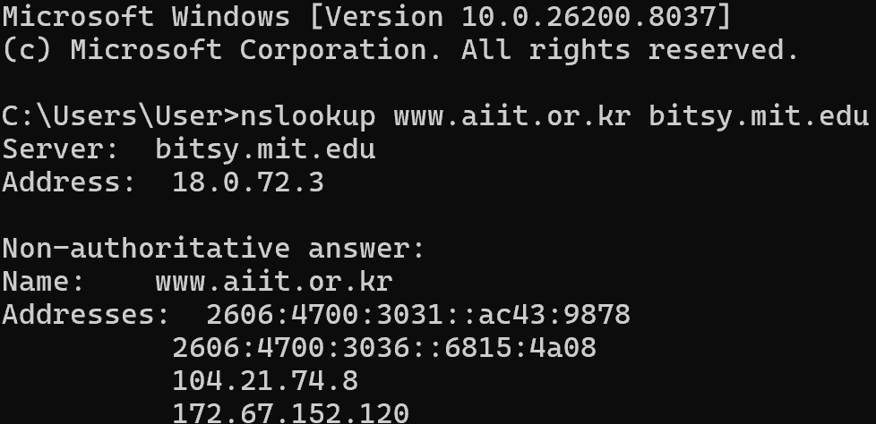
3. Setelah itu, hentikan proses capture paket di Wireshark.

Jawab:
1. Berdasarkan hasil tangkapan Wireshark pada frame 3705, pesan permintaan DNS dikirim ke alamat IP 18.0.72.3. Alamat IP tersebut bukan merupakan DNS lokal, melainkan server DNS bitsy.mit.edu yang digunakan secara langsung pada perintah nslookup.

2. Berdasarkan hasil analisis pada paket DNS query di frame 3705, jenis (type) pesan tersebut adalah A (Address). Pesan permintaan ini tidak mengandung jawaban (answers = 0), karena hanya berisi permintaan dari client untuk mengetahui alamat IP dari domain tujuan.
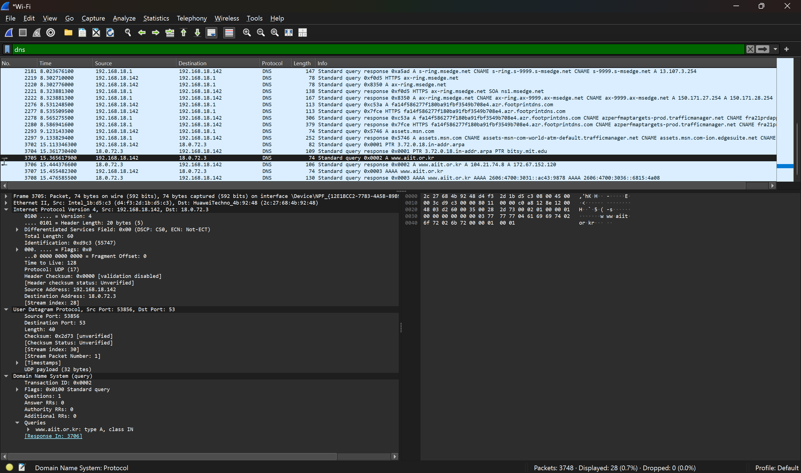

3. Berdasarkan hasil analisis pada pesan balasan DNS, terdapat 2 jawaban (Answers = 2). Kedua jawaban tersebut berisi alamat IP untuk domain www.aiit.or.kr, yaitu:104.21.74.8 dan 172.67.152.120
Dengan demikian, server DNS memberikan lebih dari satu alamat IP untuk domain tersebut, yang biasanya digunakan untuk load balancing atau redundansi layanan.
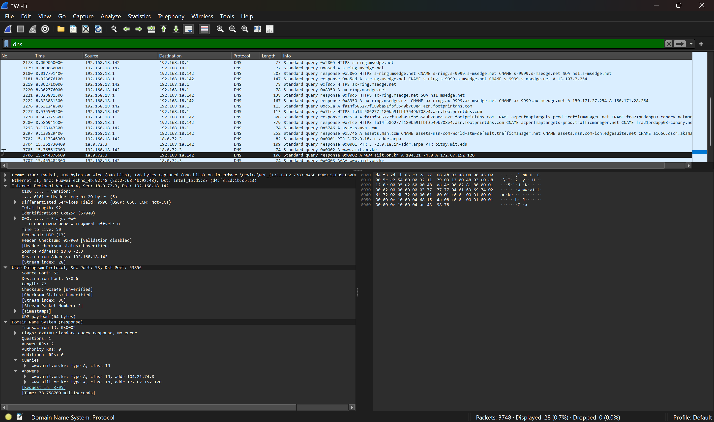