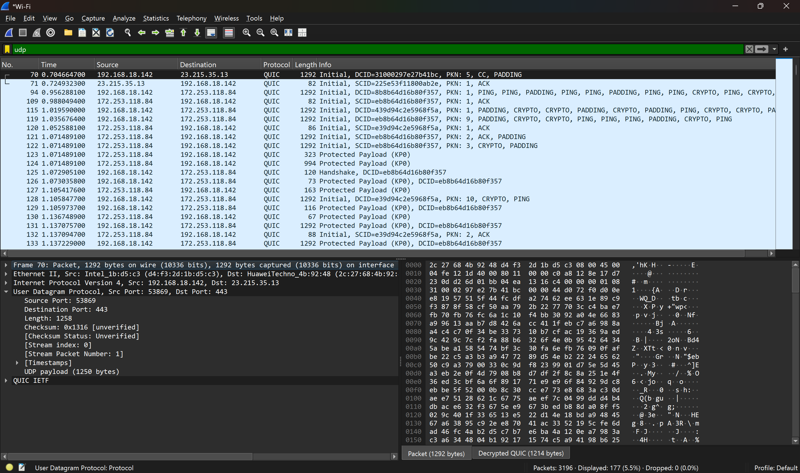
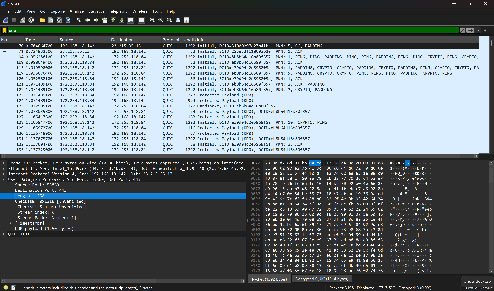
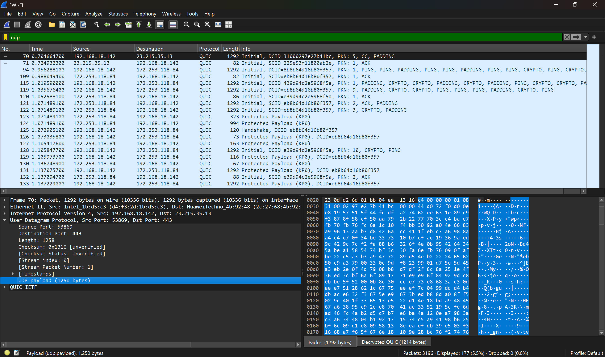
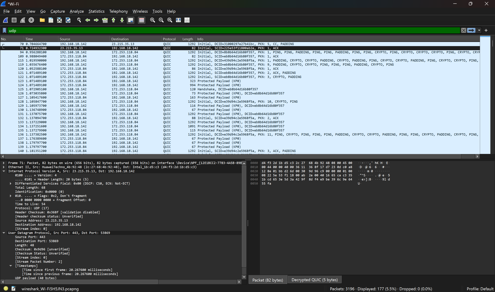
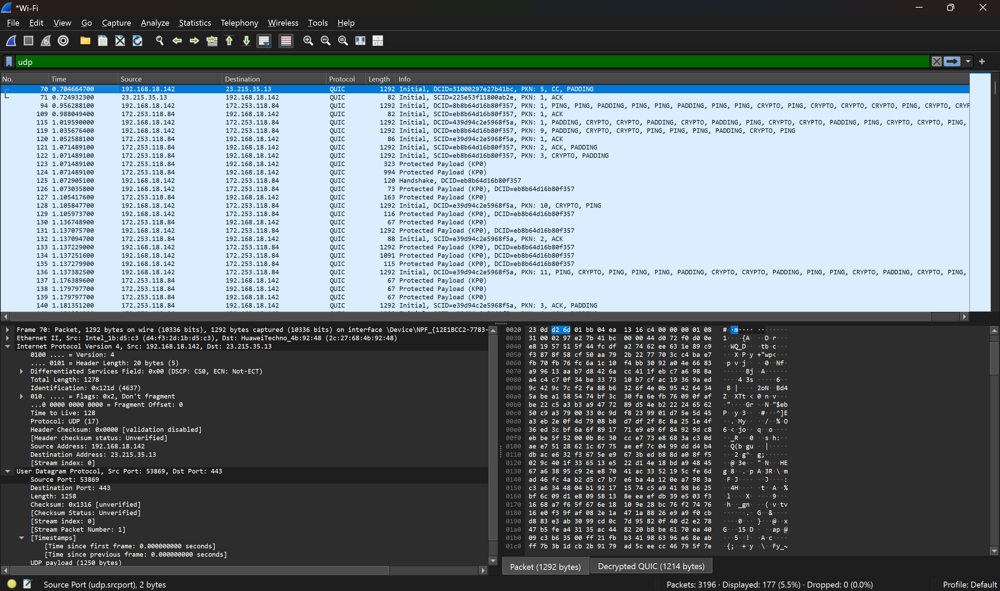

# Laporan Praktikum Jarkom jarkom Modul 5 UDP

## Tujuan Praktikum
 mahasiswa dapat mengetahui cara kerja protokol UDP menggunakan Wireshark

## 5.2
## Jawab
1. Ada 4 field yang terdapat pada header UDP yaitu:
- Source Port
- Destination Port
- Length
- Checksum

2. Panjang masing-masing field pada header UDP adalah 2 byte

3. Field Length pada header UDP menyatakan total panjang paket UDP dalam satuan byte. Pada gambar tersebut terlihat bahwa nilai UDP Length =1258 byte, yang diperoleh dari hasil perhitungan 8 byte + 1250 byte =1258 byte.

4. Field Length pada header UDP berukuran 16 bit. Nilai maksimum yang dapat direpresentasikan oleh 16 bit adalah: 2¹⁶ − 1 = 65.535 byte

5. Nomor port pada header UDP (Source Port dan Destination Port) menggunakan field 16 bit, sehingga nilai maksimumnya adalah 2¹⁶ − 1 = 65.535.

6. Nomor protokol untuk UDP pada header paket adalah 17 dalam notasi desimal dan 0x11 dalam notasi heksadesimal.

7. Pada paket pertama, Source Port = 53869 dan Destination Port = 443, sedangkan pada paket kedua, Source Port = 443 dan Destination Port = 53869, sehingga terlihat bahwa source dan destination port pada kedua paket tersebut saling bertukar.
