# Laporan Praktikum Jarkom Modul 6 TCP

## Tujuan Praktikum
 Mahasiswa dapat mengetahui cara kerja protokol TCP menggunakan Wireshark

## 6.2 Menangkap Tansfer TCP dalam Jumlah Besar dari Komputer Pribadi ke Remote Server
Langkah-langkah

1. Buka URL http://gaia.cs.umass.edu/wireshark-labs/alice.txt 
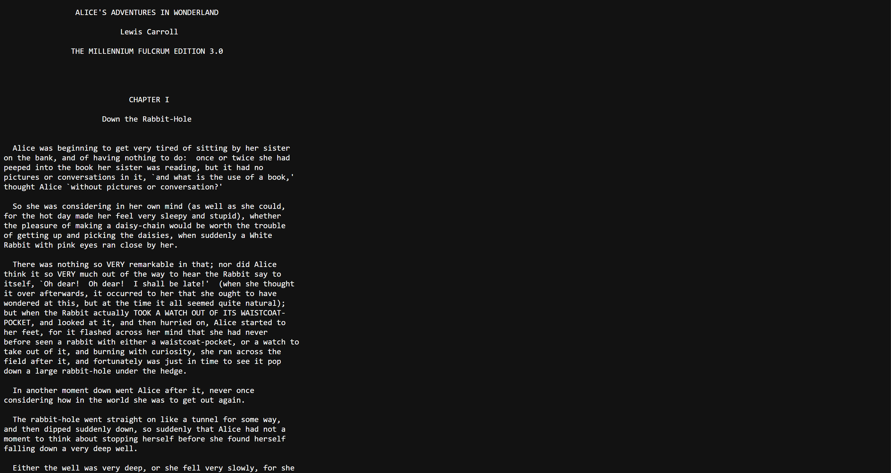

2. Salin seluruh teks “Alice” ke Notepad, lalu simpan.
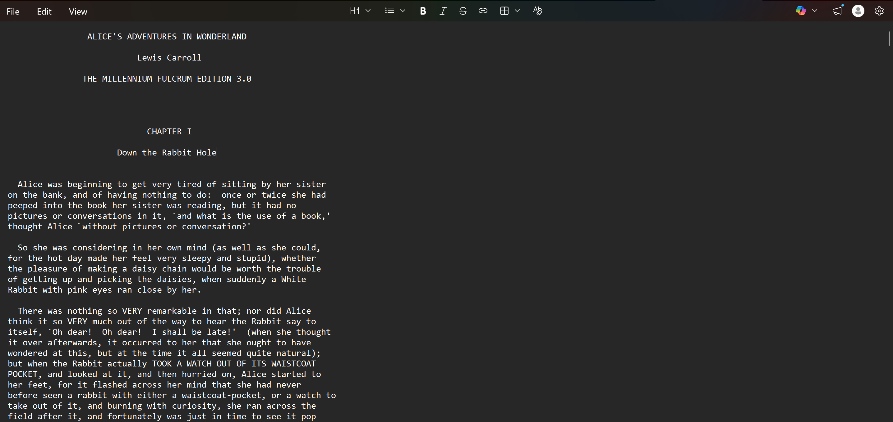

3. Buka URL http://gaia.cs.umass.edu/wireshark-labs/TCP-wireshark-file1.html hingga tampil halaman seperti ini.
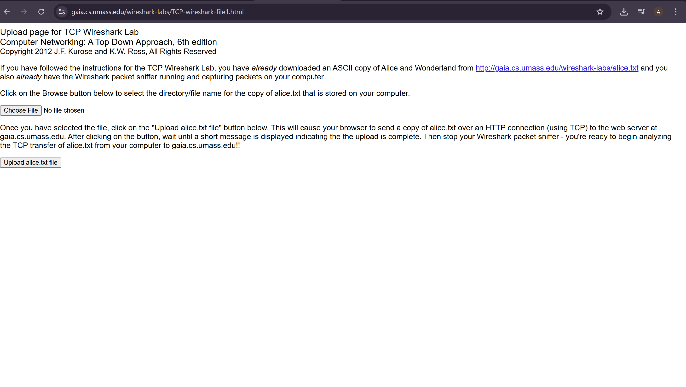

4. Klik tombol “choose file”, kemudian pilih file Alice yang sudah disimpan sebelumnya.
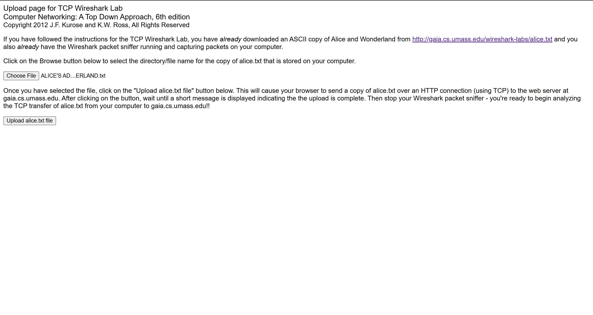

5. Mulai capture di Wireshark, tunggu beberapa saat, lalu klik “upload file” hingga proses upload selesai.
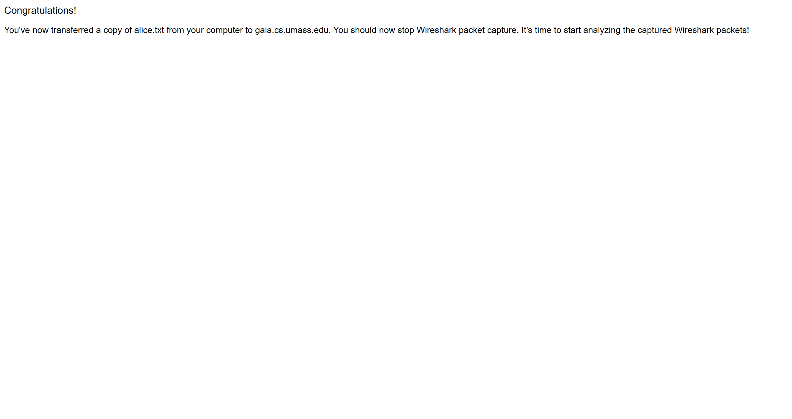

6. Hentikan proses capture, maka hasilnya akan terlihat seperti ini.
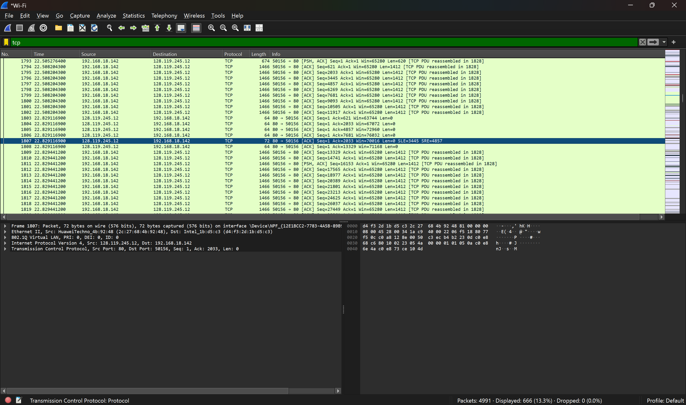

## 6.3 Tampilan Awal pada Captured Trace
Langkah-langkah

1. Unduh file trace (zip) dari http://gaia.cs.umass.edu/wireshark-labs/wireshark-traces.zip, lalu ekstrak.
2. Cari file tcp-ethereal-trace-1, lalu ubah namanya jadi tcp-ethereal-trace-1.pcap supaya bisa dibuka di Wireshark.
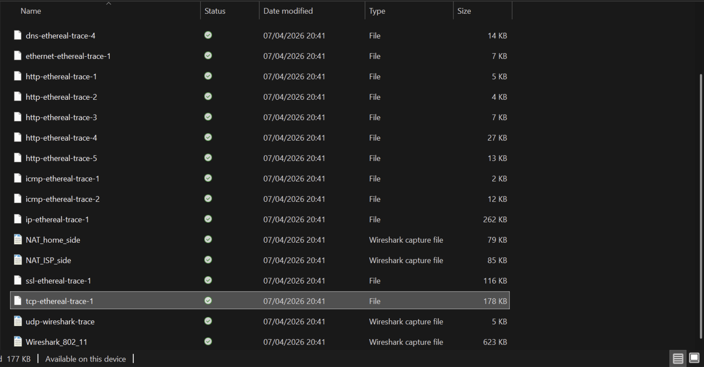

3. Buka file tersebut di Wireshark, nanti akan terlihat proses Three-way Handshake.
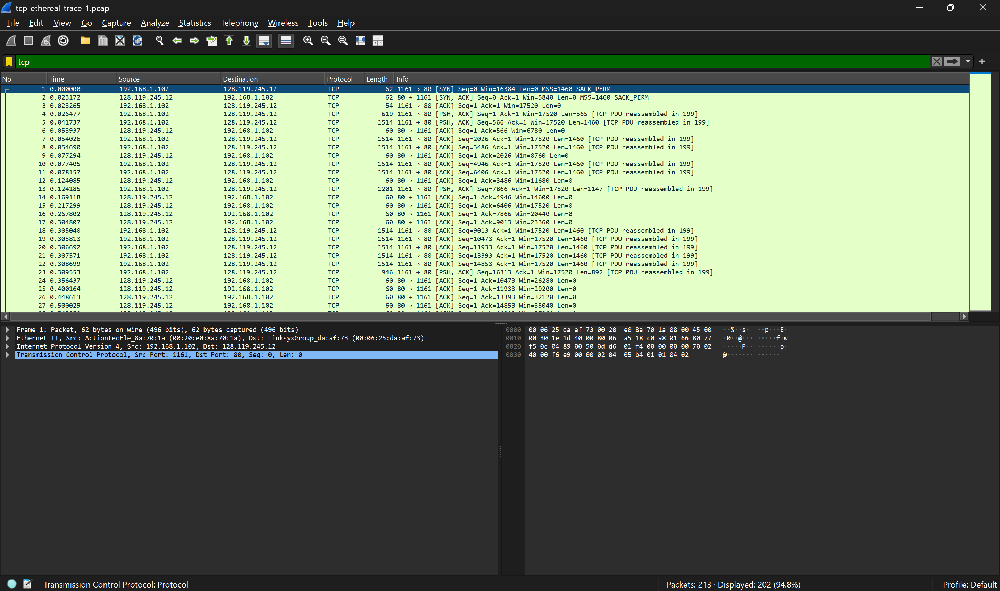

Pertanyaan:
1. Berapa alamat IP dan nomor port TCP yang digunakan oleh komputer klien (sumber) untuk mentransfer file ke gaia.cs.umass.edu? Cara paling mudah menjawab pertanyaan ini adalah dengan memilih sebuah pesan HTTP dan meneliti detail paket TCP yang digunakan untuk membawa pesan HTTP tersebut.
2. Apa alamat IP dari gaia.cs.umass.edu? Pada nomor port berapa ia mengirim dan menerima segmen TCP untuk koneksi ini?

Jawab:
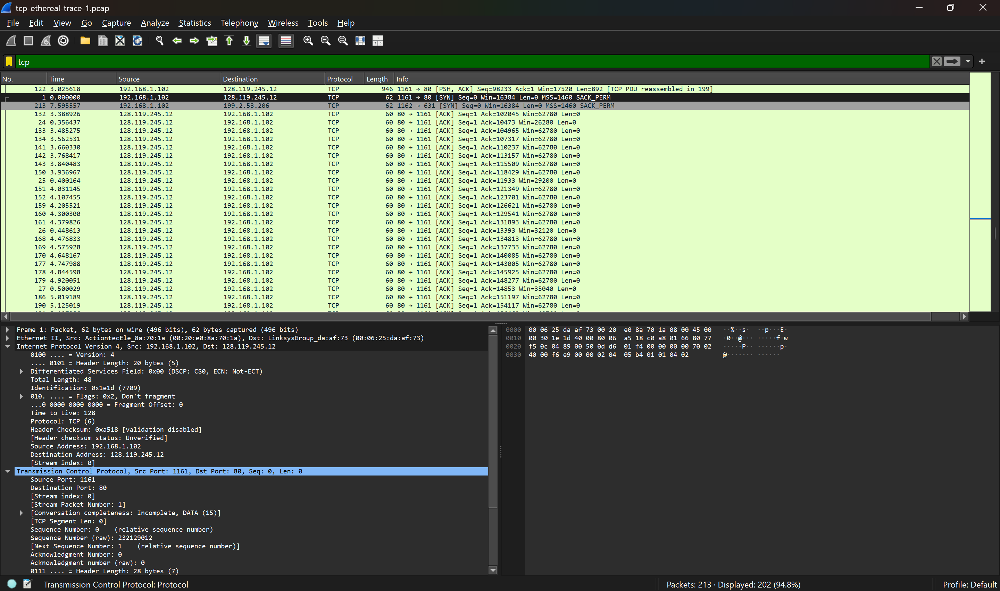
1. Alamat IP klien adalah 192.168.1.102, terlihat pada bagian IPv4 Source Address. Nomor port TCP yang digunakan adalah 1161, terlihat pada bagian TCP Source Port. Port ini digunakan klien untuk mengirim data ke server.
2. Alamat IP server gaia.cs.umass.edu adalah 128.119.245.12. Server menggunakan port 80 untuk menerima dan mengirim segmen TCP, sedangkan klien menggunakan port 1161 dalam koneksi ini.

## 6.4 HTML Documents dengan Embedded Objects
Pertanyaan:
1. Berapa nomor urut segmen TCP SYN yang digunakan untuk memulai sambungan TCP antara komputer klien dan gaia.cs.umass.edu? Apa yang dimiliki segmen tersebut sehingga teridentifikasi sebagai segmen SYN?
2. Berapa nomor urut segmen SYNACK yang dikirim oleh gaia.cs.umass.edu ke komputer klien sebagai balasan dari SYN? Berapa nilai dari field Acknowledgement pada segmen SYNACK? Bagaimana gaia.cs.umass.edu menentukan nilai tersebut? Apa yang dimiliki oleh segmen sehingga teridentifikasi sebagai segmen SYNACK?
3. Berapa nomor urut segmen TCP yang berisi perintah HTTP POST? Perhatikan bahwa untuk menemukan perintah POST, Anda harus menelusuri content field milik paket di bagian bawah jendela Wireshark, kemudian cari segmen yang berisi "POST" di bagian field DATAnya.
4. Anggap segmen TCP yang berisi HTTP POST sebagai segmen pertama dalam koneksi TCP. Berapa nomor urut dari enam segmen pertama dalam TCP (termasuk segmen yang berisi HTTP POST)? Pada jam berapa setiap segmen dikirim? Kapan ACK untuk setiap segmen diterima? Dengan adanya perbedaan antara kapan setiap segmen TCP dikirim dan kapan acknowledgement-nya diterima, berapakah nilai RTT untuk keenam segmen tersebut?Berapa nilai EstimatedRTT setelah penerimaan setiap ACK? (Catatan: Wireshark memiliki fitur yang memungkinkan Anda untuk memplot RTT untuk setiap segmen TCP yang dikirim. Pilih segmen TCP yang dikirim dari klien ke server gaia.cs.umass.edu pada jendela "daftar JARINGAN KOMPUTER 36 paket yang ditangkap". Kemudian pilih: Statistics->TCP Stream Graph- >Round Trip Time Graph).
5. Berapa panjang setiap enam segmen TCP pertama?
6. Berapa jumlah minimum ruang buffer tersedia yang disarankan kepada penerima dan diterima untuk seluruh trace? Apakah kurangnya ruang buffer penerima pernah menghambat pengiriman?
7. Apakah ada segmen yang ditransmisikan ulang dalam file trace? Apa yang anda periksa (di dalam file trace) untuk menjawab pertanyaan ini?

Jawab:
1. Sequence number pada segmen TCP SYN adalah 0 (relative). Segmen ini bisa dikenali dari flag SYN yang aktif sebagai tanda awal koneksi.
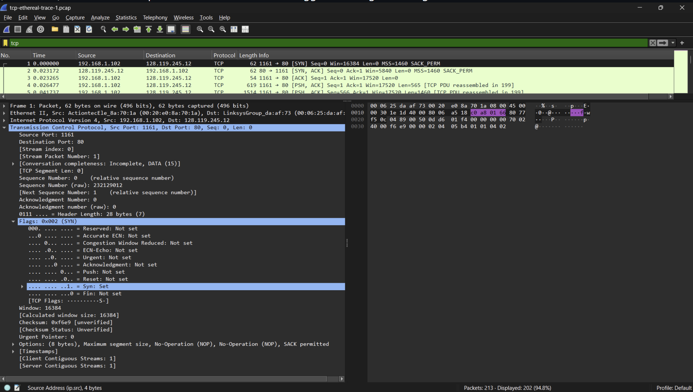

2. Sequence number segmen SYN-ACK dari server adalah 0 dengan nilai acknowledgement 1. Nilai ACK ini didapat dari sequence SYN milik klien yang ditambah 1. Segmen ini ditandai dengan flag SYN dan ACK aktif.
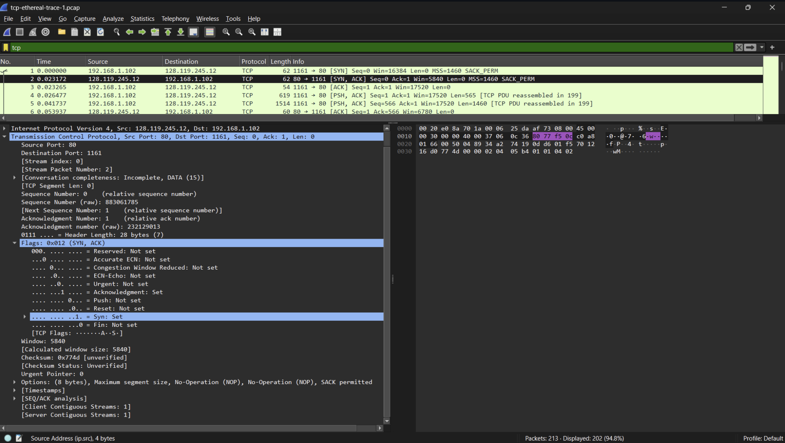

3. Sequence number pada segmen yang berisi perintah HTTP POST adalah 164041. Ini terlihat pada paket POST di Wireshark dan merupakan awal pengiriman data dari klien ke server.
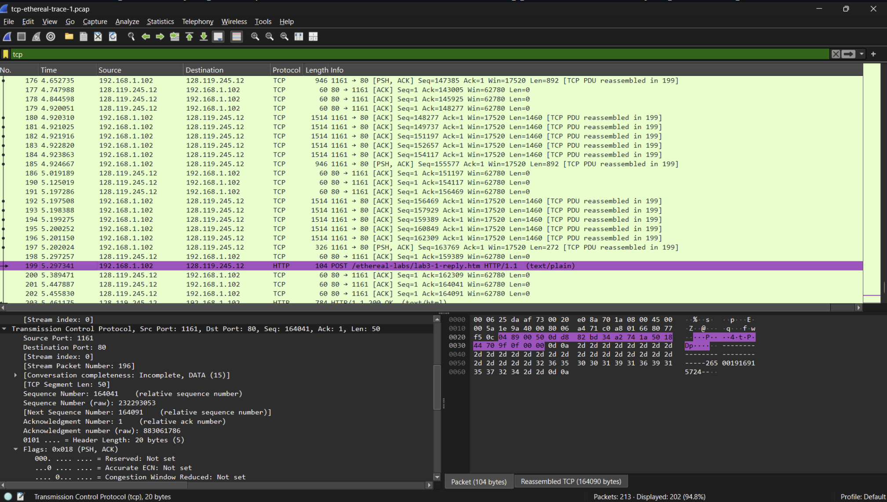

4. Segmen POST pertama dikirim pada waktu 5.297341 dengan sequence 164041, lalu diikuti beberapa segmen lainnya. ACK dari server diterima dalam waktu yang berdekatan. Nilai RTT berada di kisaran 100–270 ms dan cukup stabil, sehingga EstimatedRTT juga tidak banyak berubah.
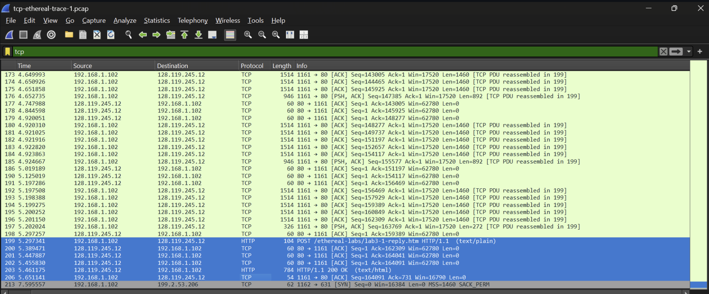
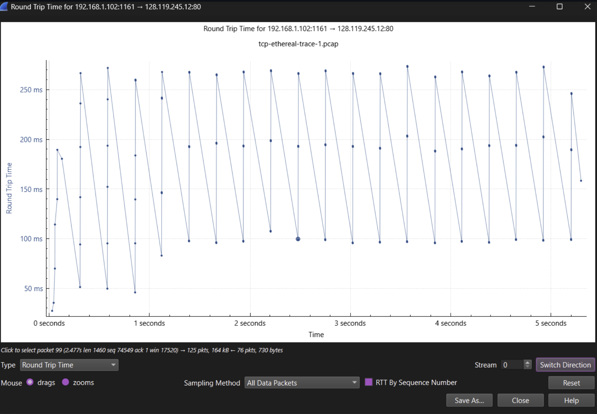

5. Panjang enam segmen TCP pertama adalah 104, 0, 0, 0, 784, dan 0 byte. Nilai 0 berarti segmen tersebut hanya berisi ACK tanpa data.
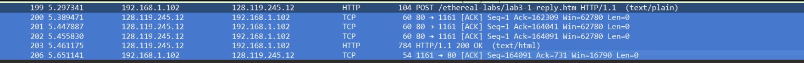

6. Nilai window size yang diiklankan adalah 62780 byte. Tidak terlihat penurunan yang signifikan, jadi buffer penerima tidak mengganggu proses pengiriman data.
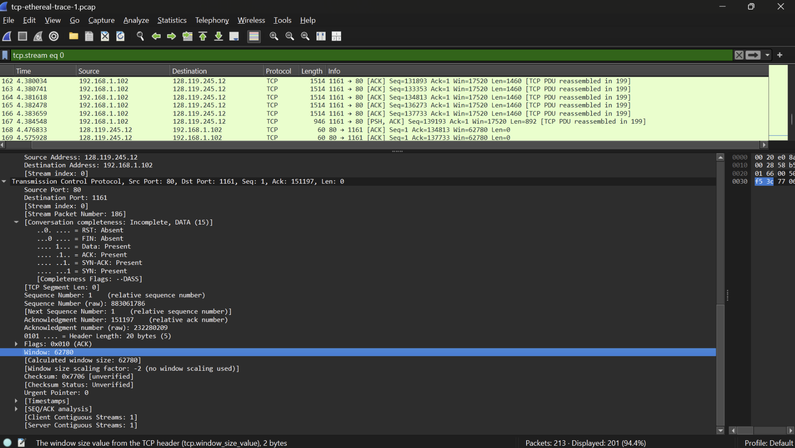

7. Tidak ditemukan adanya retransmission. Saat dicek dengan filter, tidak ada paket yang terdeteksi, sehingga bisa disimpulkan tidak ada packet loss selama komunikasi.
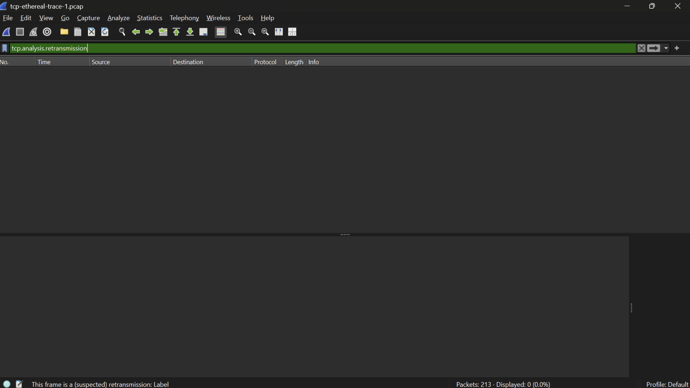

## 6.5 HTT Authentication
Pertanyaan: 
1. Gunakan alat plotting Time-Sequence-Graph (Stevens) untuk melihat grafik nomor urut berbanding waktu dari segmen yang dikirim oleh klien ke server gaia.cs.umass.edu. Dapatkah Anda mengidentifikasi di mana fase “slow start” TCP dimulai dan berakhir, dan pada bagian mana algoritma ”congestion avoidance” mengambil alih? Berikan komentar tentang bagaimana data yang diukur berbeda dari perilaku ideal TCP yang telah kita pelajari.

Jawab:
1. Fase slow start terlihat di awal transmisi, sekitar t = 0 sampai 0,5 detik. Di bagian ini, nomor urut naik dengan cepat, yang berarti cwnd bertambah secara eksponensial.
Setelah itu masuk ke fase congestion avoidance, yang terlihat dari grafik mulai lebih stabil dan membentuk garis linear. Pada fase ini, TCP menaikkan cwnd secara bertahap (sekitar satu MSS tiap RTT) supaya tidak terjadi kemacetan di jaringan.
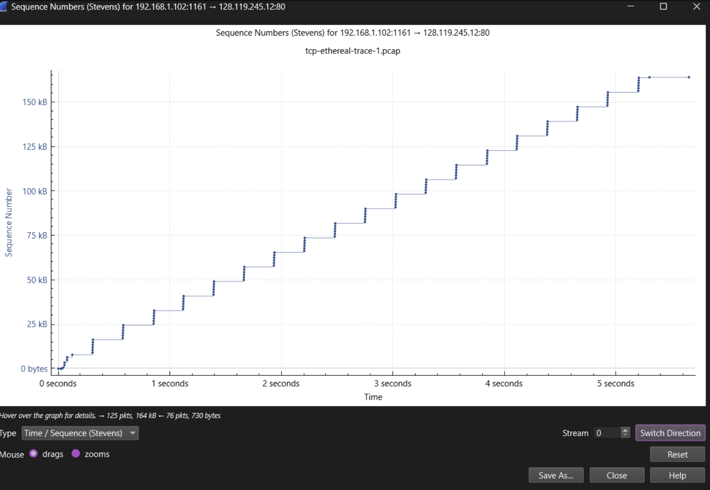

