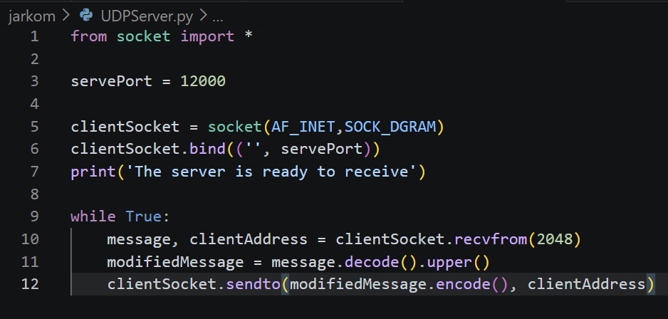
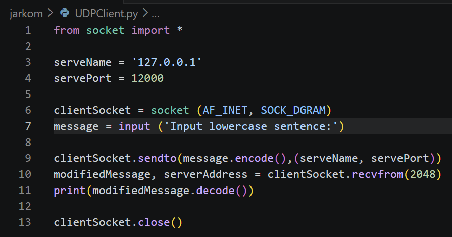
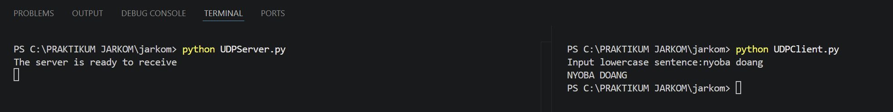
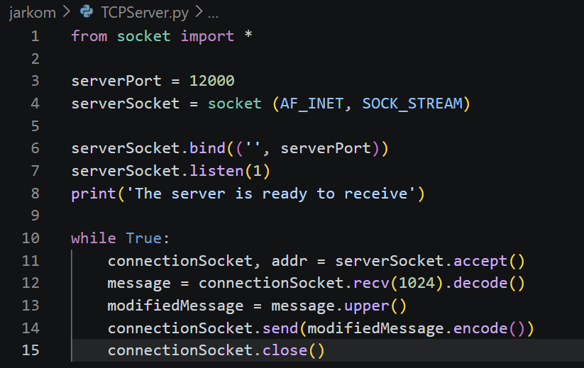
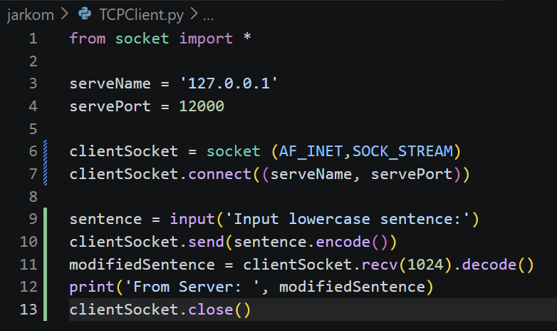
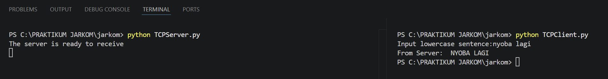

# LAPORAN PRAKTIKUM JARKOM MODUL 7 SOCKET PROGRAMMING: MEMBUAT APLIKASI JARINGAN

## 7.2 Program Socket dengan UDP
1. Pertama, client membuat socket menggunakan socket(AF_INET, SOCK_DGRAM) sebagai media komunikasi UDP.
2. Setelah itu client menentukan alamat IP server dan port tujuan yang akan digunakan untuk mengirim data.
3. Lalu pengguna memasukkan pesan menggunakan input().
4. Selanjutnya pesan diubah ke bentuk byte dengan .encode() lalu dikirim ke server menggunakan sendto().
5. Di sisi server, socket dibuat dengan cara yang sama lalu dihubungkan ke port tertentu menggunakan bind().
6. Setelah itu server menjalankan while True agar dapat terus menerima pesan dari client.
7. Ketika data diterima menggunakan recvfrom(), server juga mendapatkan alamat client pengirim pesan.
8. Lalu data diubah dari byte menjadi string menggunakan .decode() dan diproses dengan .upper() agar huruf menjadi kapital.
9. Setelah itu hasilnya diubah kembali ke bentuk byte menggunakan .encode() lalu dikirim ke client memakai sendto().
10. Terakhir, client menerima balasan dari server menggunakan recvfrom() kemudian menampilkannya ke layar dengan .decode().

Output

## 7.3 Program Socket dengan TCP
1. Pertama, server membuat socket menggunakan socket(AF_INET, SOCK_STREAM) sebagai media komunikasi TCP.
2. Setelah itu server menghubungkan socket ke port tertentu menggunakan bind() agar server berjalan pada port 12000.
3. Lalu server menjalankan listen(1) supaya dapat menunggu koneksi dari client.
4. Server menampilkan pesan bahwa server siap menerima koneksi dari client.
5. Setelah itu server menjalankan while True agar server terus aktif dan bisa melayani banyak client secara bergantian.
6. Ketika ada client yang terhubung, server menerima koneksi menggunakan accept() dan membuat socket baru khusus untuk komunikasi dengan client tersebut.
7. Selanjutnya server menerima data dari client menggunakan recv(1024) lalu mengubah data dari byte menjadi string dengan .decode().
8. Data yang diterima kemudian diproses menggunakan .upper() agar semua huruf berubah menjadi kapital.
9. Setelah itu hasilnya diubah kembali ke bentuk byte menggunakan .encode() lalu dikirim ke client memakai send().
10. Setelah komunikasi selesai, koneksi client ditutup menggunakan close(), tetapi server tetap berjalan untuk menerima client berikutnya.
11. Di sisi client, socket dibuat menggunakan socket(AF_INET, SOCK_STREAM) lalu client terhubung ke server menggunakan connect().
12. Setelah itu client mengambil input dari pengguna menggunakan input() lalu mengirimkannya ke server menggunakan send() setelah diubah ke bentuk byte.
13. Terakhir, client menerima balasan dari server menggunakan recv(1024), lalu data diubah kembali menjadi string dengan .decode() dan ditampilkan ke layar.

Output
